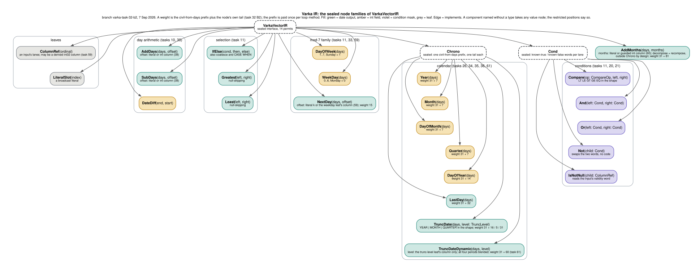

Varka is a research/experimental execution engine inside this Spark fork. It
compiles whole date-expression projections into a single SIMD vector loop -
bytecode emitted with the JDK 25 Class-File API, running the Vector API over
zero-copy Panama `MemorySegment` views of Arrow `DateDayVector` buffers -
bypassing Spark's per-row code generation on the happy path.

This page is long, and the sections stand on their own. If you are new here, the
**Glossary** is the one to read first - *lane*, *word*, *morsel* and *epilogue* all mean
something specific in this engine and appear on almost every page after it.

* Table of contents
{:toc}

## Overview

The Spark SQL runtime normally executes expressions by generating Java source,
compiling it with Janino, and running one expression evaluation per row. Varka
eliminates that runtime compilation overhead (string generation and Janino
parsing) and unlocks SIMD by operating on whole columnar batches at once.
Since milestone 2 it does not dispatch to per-op kernels: an eligible
projection is compiled to a vector IR and *fused* - however many expressions
and however deep their nesting, the emitted class runs one loop with one load
per input column and one store per output. Since task 21 the same machinery
serves filters: an eligible predicate becomes a mask kernel whose single
output is the selection bitmap, and the batch is compacted - or its rows
skipped at the row boundary - by that mask.

Varka reads three Spark types, and they are the three that are int32 both in
Spark and in the Arrow cache: `DateType` (stored as `INT` days since epoch),
`IntegerType`, and `YearMonthIntervalType` in every unit (task 67), whose value
is a count of months whether it is spelled `INTERVAL YEAR`, `INTERVAL MONTH` or
`INTERVAL YEAR TO MONTH`. An interval column reaches the same lanes as a date
one; where it may appear is decided by Spark's own typing, so it fuses in
`d + ym`, in the ordered comparisons and `IN`, and in the same-typed
`greatest`/`least`/`coalesce`/`IF`/`CASE`. `CAST` between an `INT` and a
`MONTH`-unit interval is a relabel in both directions and emits nothing, as is
the cast between two year-month units that ends at `MONTH` - the one type
coercion inserts when two units meet, so `ymm + ymy` fuses like `ymm + ymm2`.
Since task 68 the `INT`-to-`YEAR` cast, which multiplies by twelve, fuses
wherever the compile-time bound rules that multiply's overflow out - over a
calendar field it does, over a bare int column it does not. The direction that
divides by twelve, which is `EXTRACT(YEAR FROM ym)`, `ym / k` and a cast that
narrows a year-month interval to a `YEAR`-ended unit, stays residual and is task
89's: the emitter's exact magic division covers about a
forty-thousandth of a full int32 month count.

Task 68 also admits the algebra whose operands and result are both intervals:
`ym + ym`, `ym - ym`, `-ym`, `abs(ym)`, `ym * k` and `make_ym_interval(y, m)`,
and, in `ADD_MONTHS`' month-count position, `d - ym_col`. None of these has a
wrapping form - Spark computes every one with `addExact`, `subtractExact`,
`negateExact` or `multiplyExact` whatever the session's ANSI mode - so the check
is unconditional and only a compile-time bound takes it off. A checked `*` has
no int-lane overflow test, so `ym * k` fuses only where the bound proves it safe
and is residual otherwise, exactly as task 63's int multiply is; `abs` is not an
op the IR has but the blend `if (ym < 0) -ym else ym`, whose negation arm alone
can condemn a batch. `try_add(ym, ym)` and the other `try_*` spellings are
residual, having no null-on-overflow lowering.

The supported expression surface, then, over those columns and day offsets that
are a foldable integer literal, an
`IntegerType` column (task 38; a `ShortType`/`ByteType` offset column still
declines) or int arithmetic over those (task 63), including that column
spelled as a day interval,
`d + CAST(i AS INTERVAL DAY)` and `d - CAST(i AS INTERVAL DAY)` (task 56; a
literal interval folds to `date_add` before planning). The cast throws past
106751991 days in every mode, so the evaluator checks the offset column per
batch and a batch holding such a value is recomputed on the row engine, which
raises that error, counted as `numFallbackBatchesDeclined`. A stored `INTERVAL
DAY` column and `i * INTERVAL '1' DAY` (which widens to a sub-day interval and
becomes timestamp arithmetic) decline:

* `DATE_ADD` / `DATE_SUB` / `DATEDIFF`, nested to any depth up to the
  emitter's chain cap, including chains mixing them.
* `CASE WHEN` and `IF` over date comparisons (`<`, `<=`, `>`, `>=`, `=`) and
  their `AND` / `OR` / `NOT` combinations - executed branch-free by mask
  blend, with SQL's three-valued null semantics. `BETWEEN` arrives from the
  optimizer as its paired comparisons and fuses the same way.
* `IN` over date literals in condition position (task 20): an EQ chain
  joined by OR, capped at 16 deduplicated literals - a longer list declines
  with a recorded reason rather than risking the emitter's budgets.
* `COALESCE` / `NVL` / `IFNULL` / `NVL2` and the `IS [NOT] NULL` predicates
  (task 20), lowered onto a validity-reading condition. Every guarded
  operand must be a bare date column; a non-column operand declines.
* `GREATEST` / `LEAST` (null-skipping) and `DAYOFWEEK` / `WEEKDAY`.
* `YEAR` / `MONTH` / `DAYOFMONTH` / `QUARTER`, and the `EXTRACT` spellings that
  desugar to them (task 26). One civil-from-days decomposition per date,
  lowered entirely to magic multiplies because no vector divide exists, and
  shared between the fields over it: `year(d), month(d), dayofmonth(d),
  quarter(d)` run one decomposition and four short tails in one loop method
  (task 32). The lowering is defined over years -12800 to 33134 -
  every date SQL can write, and then some - and the range is enforced where a
  day can leave it, not at every extraction (tasks 51 and 52). It stays exact
  for a further nine thousand years, to 42400, which is what an *intermediate*
  may reach: a value the compiler has already bounded below and is only
  shifting upward is admitted against that wider ceiling rather than the
  enforced one (task 69). A date column
  is taken to hold `0001-01-01..9999-12-31`, the project's column contract,
  and is not checked at ingestion. The compiler bounds how far the arithmetic
  under a calendar function can shift such a day - literal `DATE_ADD` offsets,
  `NEXT_DAY`, `LAST_DAY`, `ADD_MONTHS` with a literal count, and their
  compositions - and an entry whose shift can leave the range is residual at
  compile time, with the interval as its reason (`year(date_add(d,
  20000000))` is the canonical case; the row engine computes it). Two
  producers it cannot bound that way carry a per-batch range check instead,
  and either one declines the whole batch to the row path, counted as
  `numFallbackBatchesDeclined`: a `DATE_ADD`/`DATE_SUB` with a *column*
  offset whose result a calendar function reads, checked against the enforced
  range above rather than the wider one an intermediate may reach, since what
  a producer hands on should stay inside the range every consumer expects; and
  an `ADD_MONTHS` with a *column*
  count, checked on the count itself (see below) - that one wherever it
  sits, because the check protects its own month arithmetic rather than a
  consumer's, so a bare `add_months(d, m)` carries it too. A `DATE_ADD` with
  no calendar consumer is never checked - it returns what 32-bit addition
  returns, as Spark's does.
* `NEXT_DAY` (task 33) with a literal weekday, resolved at compile time so
  one kernel class serves every weekday; a null or unrecognized literal
  declines. Since task 59 a weekday *column* fuses too, through a derived
  input: before the kernel runs, the evaluator maps the string column to the
  weekday number per batch by the row engine's own parser, so the kernel reads
  an int column and the semantics are the row engine's by construction - an
  unrecognized name is NULL with ANSI off; with ANSI on it declines the batch
  to the row engine, which raises its `ILLEGAL_DAY_OF_WEEK` error where a
  non-null date sits beside the name and returns NULL where the date is null,
  exactly as it does alone. Any collation is admitted, since the parser
  ignores it. A weekday that is an expression over a column stays residual.
* `DAYOFYEAR` (task 34), `LAST_DAY` (task 36) and `ADD_MONTHS` / `date +
  INTERVAL n MONTH` (task 40), all over the same civil-from-days prefix;
  `LAST_DAY` and `ADD_MONTHS` return dates. `ADD_MONTHS`' month count is a
  literal, (task 60) an integer column, (task 67) a stored year-month
  interval column, or (task 68) arithmetic over any of those - the negation
  behind `d - ym_col`, and the `CAST(m AS INTERVAL YEAR)` whose value is
  twelve times the column rather than the column itself. What lets a derived
  count in is that the range check below is lanewise on the count's *value*
  and cares nothing about what produced it; `NEXT_DAY`'s weekday, which has
  no such check, still takes a literal or a column only. A column count
  carries a per-batch
  range check on the count itself, the same route as the day producer above:
  a lane outside `VarkaChrono.MONTH_ARITH_MIN/MAX_MONTHS` (about 2047 years
  either way, where the lowering's magic division by 12 stops being exact)
  declines the batch to the row engine rather than compute past it.
* `MAKE_DATE(year, month, day)` (task 42) over int columns and literals, in
  both evaluation modes: an invalid month or day is a null date with ANSI
  off and, with ANSI on, sends the batch to the row engine, which raises
  Spark's own error at that row; a year outside the whole years of the
  calendar range goes to the row engine in both modes, so the kernel never
  publishes a date the lowering is not exact for.
* `WEEKOFYEAR`, `EXTRACT(WEEK FROM d)` and `DATE_PART('WEEK', d)` (task 37), the ISO-8601 week
  by the Thursday rule: the day is moved to the Thursday of its Monday-based
  week and the week is that Thursday's ordinal day in sevens, so the year
  boundaries need no correction. The shift is its own node and the week tail's
  prefix runs over it, which is what makes `EXTRACT(YEAROFWEEK FROM d)`
  (task 58) `YEAR` over the same shift, sharing the shift and its prefix with
  `WEEKOFYEAR` of the same date; a projection mixing either with `YEAR` or
  `MONTH` of the same date decomposes twice, once per side.
* `EXTRACT(DAYOFWEEK_ISO FROM d)` / `DATE_PART('DOW_ISO', d)` (task 57),
  Monday 1 to Sunday 7, as one node: the analyzer spells it `weekday(d) + 1`,
  and that spelling by hand fuses the same way. Since task 63 any other
  integer arithmetic over a field fuses too, but as arithmetic over the
  weekday rather than as this node, so `weekday(d) + 2` answers 2 more than
  the weekday and not 1.
* `TRUNC(date, fmt)` at the date levels. With a literal format (task 35),
  `YEAR`/`YYYY`/`YY`, `MONTH`/`MON`/`MM` and `QUARTER` are one node each with
  the level as part of the kernel's shape, and `WEEK` is rewritten onto
  `NEXT_DAY` over `DATE_SUB`, which is Spark's own definition of it. With a
  stored string column as the format (task 61), one node computes all four
  periods per row and selects on the level, which the evaluator parses per
  batch through the row engine's own `parseTruncLevel` into a derived int32
  input (the mechanism `NEXT_DAY` uses for a weekday column), so any collation
  is admitted; rows whose format is null, unrecognised or below a day are NULL,
  as on the row engine, in either ANSI mode. That node costs about the three
  literal tails plus the week's, so a literal format remains the shape to
  write. The output is a date that can feed further date arithmetic in the
  same fused chain. A literal null format, a literal spelling `trunc` does not
  accept, every sub-day literal level, and a format that is an expression over
  a column decline: the row engine answers the literal cases with a NULL
  column, which no kernel can produce.
* `UNIX_DATE` relabels a date column to its underlying `INT` day count with no
  new node and no emitted code (task 41); the paired `DATE_FROM_UNIX_DATE`
  compiles the same way but still declines, since its child is an integer
  column and only a `date_add`/`date_sub` offset position reads one (task 38).
* `+`, `-`, `*` and unary `-` over int32 values (task 63): an `IntegerType`
  column, an int literal, any fused int field (`YEAR`, `MONTH`, `DATEDIFF`,
  the weekday family) or nested arithmetic over those. The evaluation mode
  travels with the node. Under `LEGACY` the lanes wrap, as `DATE_ADD` always
  has. Under ANSI a sign test marks the overflowing lanes and the batch is
  recomputed on the row engine, which raises Spark's own
  `ARITHMETIC_OVERFLOW`; `TRY_ADD`, `TRY_SUBTRACT` and `TRY_MULTIPLY` clear
  those lanes from the output's validity instead and the batch runs on. Where
  the operands' own ranges prove the result cannot leave int32 the check is not
  emitted at all, which is what lets `YEAR(d) * 100 + MONTH(d)` fuse under
  ANSI. The calendar bounds every field; `DATEDIFF` is bounded only where both
  of its operands are, so a `DATE_ADD` with an offset large enough to wrap the
  int32 day, or one shifted by a column with no calendar function over it,
  leaves the difference unbounded and the check in place. Both of those rest on
  the stored-date contract below, which nothing enforces at ingestion: a date
  column holding a day outside 0001..9999 can carry a bound that is not true of
  it. A checked multiply whose operands carry no such bound declines: an
  int32 lane has no cheap overflow test for `*`, so it stays on the row engine
  rather than wrapping silently. `DIV`, `%` and the float and long types are
  not lowered.
* Common subtrees shared *across* outputs are computed once per lane group
  (DAG-CSE), which no per-row engine can keep in a vector register.

A projection does not have to be fully eligible: eligible entries fuse,
untouched input columns are forwarded zero-copy, and the remaining entries run
the standard row path per row, merged with the kernel outputs (task 12).

Explicitly out of scope are `CalendarInterval` (a struct of months, days and
microseconds), `DayTimeIntervalType` (int64 microseconds), strings, decimals and
nested/complex types. Day offsets are int32, whether a literal, a column or
arithmetic over them.

Varka is designed as a drop-in, zero-risk replacement: every Varka path falls
back to the standard row engine on any failure, so results are always correct.

## Expression coverage

One row per expression the compiler fuses, in the spelling you would write it,
over the columns of the benchmark's `varka_dates` table: `d` and `d2` are dates,
`i` an int, and `ymm`, `ymy` and `ym` year-month intervals of the three unit
ranges. The Overview above states the conditions in prose; this is the list to
scan when the question is simply whether an expression is covered.

Anything absent declines and runs on Spark's row engine. A decline is a normal
outcome, not an error: the entries that fuse still fuse, and the rest of the
projection is unaffected.

Two conditions are worth stating before the list, because they decide several
rows and are invisible in the spelling. A comparison reads the date lane, so a
bare `IntegerType` column in comparison position declines - `year(d) = 2021`
fuses, `i > 0` does not, although `i` is fine in arithmetic. And a checked
multiply fuses only where a bound proves it cannot overflow, which is why the
multiply rows below are written over a calendar field rather than over a plain
column.

The table is generated, not written. `VarkaCoverageSuite` compiles every row
below through `VarkaExpressionCompiler` and fails if any of them declines, fails
if the compiler matches an expression class that no row exercises, and fails if
this file differs from what it renders. So a table claiming an expression the
engine does not have, and a table missing one the engine gained, are both build
failures. Regenerate it after adding a row with:

```
VARKA_COVERAGE_REGEN=true build/sbt 'catalyst/testOnly *VarkaCoverageSuite'
```

<!-- BEGIN generated coverage table -->
The *128-bit lanes* column is `sql/varka/width_audit.json`'s census on AMD Ryzen AI 9 HX PRO 370 w/ Radeon 890M at a forced 128-bit species: `vector` means C2 refused no Vector API call in the row's kernel there; `per-lane` names the constructions it had no lowering for, which then run as Java loops over the lanes (task 153). It is this x86 JVM's table below its own width: the pool's aarch64 runner, whose native species is 128 bits, refuses nothing (`PLAN_TASK_153.md` 6).

#### Day arithmetic

| Expression | Notes | 128-bit lanes |
|---|---|---|
| `date_add(d, 3)` |  | vector |
| `date_add(d, i)` | a column offset, under a per-batch bound on its range | vector |
| `date_sub(d, 5)` |  | vector |
| `d + CAST(i AS INTERVAL DAY)` | the day-interval spelling of a column offset | vector |
| `datediff(d2, d)` |  | vector |
| `unix_date(d)` |  | vector |
| `date_from_unix_date(unix_date(d))` |  | vector |

#### Calendar fields

| Expression | Notes | 128-bit lanes |
|---|---|---|
| `year(d)` |  | vector |
| `month(d)` |  | vector |
| `day(d)` |  | vector |
| `quarter(d)` |  | vector |
| `dayofyear(d)` |  | vector |
| `dayofweek(d)` |  | vector |
| `weekday(d)` |  | vector |
| `extract(DAYOFWEEK_ISO FROM d)` |  | vector |
| `weekofyear(d)` |  | vector |
| `extract(YEAROFWEEK FROM d)` |  | vector |
| `last_day(d)` |  | vector |
| `next_day(d, 'MONDAY')` | the day name must be a literal | vector |
| `make_date(2021, i, 1)` |  | vector |
| `trunc(d, 'YEAR')` |  | vector |
| `trunc(d, 'MONTH')` |  | vector |
| `trunc(d, 'QUARTER')` |  | vector |
| `trunc(d, 'WEEK')` |  | vector |

#### Months and year-month intervals

| Expression | Notes | 128-bit lanes |
|---|---|---|
| `add_months(d, 3)` |  | vector |
| `add_months(d, i)` |  | vector |
| `d + INTERVAL 3 MONTH` |  | vector |
| `d + ym` |  | vector |
| `d - ym` |  | vector |
| `make_ym_interval(year(d), month(d))` | the operands must be bounded - over a bare int column the checked multiply inside it keeps its overflow test and declines | vector |
| `make_ym_interval(year(d), month(d)) * 2` | a checked multiply, so bounded operands again: `ym * 2` over a stored interval column declines | vector |
| `abs(ym)` |  | vector |
| `ym - ymm` |  | vector |
| `CAST(ymy AS INTERVAL MONTH)` |  | vector |
| `extract(YEAR FROM ym)` | a division by twelve over a month count nothing bounds, so the calendar's range-narrowed magic cannot serve it; a multiply-high through 64-bit lanes does | vector |
| `extract(YEAR FROM ym) - 1` | the quotient feeding further int arithmetic | vector |

#### Integer arithmetic

| Expression | Notes | 128-bit lanes |
|---|---|---|
| `i + 1` |  | vector |
| `i - 1` |  | vector |
| `year(d) * 2` | a multiply is checked, and only bounded operands take the check off: `i * 2` over a bare int column declines | vector |
| `-i` |  | vector |
| `year(d) + i` |  | vector |

#### Choice and nulls

| Expression | Notes | 128-bit lanes |
|---|---|---|
| `if(d < d2, d, d2)` |  | vector |
| `CASE WHEN d < d2 THEN d ELSE d2 END` |  | vector |
| `coalesce(d, d2)` |  | vector |
| `greatest(d, d2)` |  | vector |
| `least(d, d2)` |  | vector |

#### Predicates

| Predicate | Notes | 128-bit lanes |
|---|---|---|
| `d IS NULL` |  | vector |
| `d IS NOT NULL` |  | vector |
| `d = d2` |  | vector |
| `d < d2` |  | vector |
| `d <= d2` |  | vector |
| `d > d2` |  | vector |
| `d >= d2` |  | vector |
| `year(d) = 2021` |  | vector |
| `NOT (d = d2)` |  | vector |
| `d IN (DATE '2021-01-01', DATE '2021-06-01')` | up to 16 literals | vector |
| `year(d) = 2021 AND i > 0` | every conjunct of an AND fuses or the predicate is not in this table; the int column compares in the kernel rather than leaving a residual row filter (task 122) | vector |
| `i > 0` | a bare int column compares in the kernel (task 122) | vector |
| `i IS NOT NULL` | the same column's validity word, which the optimizer infers beside `i > 0` | vector |
| `i = 5` |  | vector |
| `month(d) > i` | an int column against a fused int field | vector |
| `year(d) = 2021 OR month(d) = 3` |  | vector |
| `d IN (11 to 16 date literals)` | an IN list this long arrives from the optimizer as an InSet and fuses the same way | vector |

#### Long-lane predicates

| Predicate | Notes | 128-bit lanes |
|---|---|---|
| `l > l2` |  | per-lane: compare to mask, mask cast |
| `l = l2` |  | per-lane: compare to mask, mask cast |
| `l >= 5000000000` | a bigint literal takes a slot in the long lane's own table | per-lane: compare to mask, mask cast |
| `l IS NULL` |  | per-lane: mask broadcast, mask logic, mask cast |
| `l IS NOT NULL` |  | per-lane: mask cast, mask broadcast |
| `t < t2` |  | per-lane: compare to mask, mask cast |
| `t = TIME'12:34:56.789'` | a TIME literal of another precision reaches the column through the widening cast, which is the identity on nanoseconds | per-lane: compare to mask, mask cast |
| `dt > dt2` |  | per-lane: compare to mask, mask cast |
| `dt < INTERVAL '0' SECOND` |  | per-lane: compare to mask, mask cast |
| `dt IS NOT NULL` |  | per-lane: mask cast, mask broadcast |

#### Long-lane choice

| Expression | Notes | 128-bit lanes |
|---|---|---|
| `greatest(l, l2)` |  | per-lane: blend, mask broadcast |
| `least(l, 5000000000)` |  | per-lane: blend, mask broadcast |
| `CASE WHEN l < l2 THEN l ELSE l2 END` |  | per-lane: compare to mask, blend, mask cast, mask broadcast |
| `if(l IS NULL, l2, l)` |  | per-lane: mask broadcast, mask logic, blend |
| `greatest(t, t2)` |  | per-lane: blend, mask broadcast |
| `CASE WHEN dt > INTERVAL '0' SECOND THEN dt ELSE dt2 END` |  | per-lane: compare to mask, blend, mask cast, mask broadcast |

#### Time arithmetic

| Expression | Notes | 128-bit lanes |
|---|---|---|
| `t - t2` | a day-time interval, the nanosecond difference divided by a thousand | vector |
| `time_diff('HOUR', t, t2)` | the unit is a literal; a column of units would need a kernel per distinct value | vector |
| `time_diff('microsecond', t2, t)` | units are read case-insensitively, as DateTimeUtils reads them | vector |
| `time_trunc('MINUTE', t)` |  | vector |
| `time_trunc('MILLISECOND', t2)` |  | vector |
| `hour(t)` | an int computed in the 64-bit lane and narrowed at the kernel's store, the one place a lane changes width until task 28; so the extract fuses as an output and declines under another expression | vector |
| `minute(t2)` |  | vector |
| `second(t)` |  | vector |
| `time_to_millis(t)` |  | vector |
| `time_to_micros(t2)` |  | vector |
| `time_from_millis(time_to_millis(t2))` | the count is guarded to the day's worth of its unit, where the multiply is exact; a count outside declines the batch and the row engine raises Spark's error, as for t + dt - so the count here is one that is inside the day by construction | per-lane: compare to mask, mask logic, mask broadcast, mask test |
| `time_from_micros(time_to_micros(t))` |  | per-lane: compare to mask, mask logic, mask broadcast, mask test |
| `t + INTERVAL '0 00:00:00' DAY TO SECOND` | a zero interval on purpose: this fixture reaches both ends of the day, so any other constant crosses midnight on some row, where Spark raises an error rather than a value. The sum is still guarded to the day; the crossing case, and a column interval, are VarkaTimeArithmeticSuite's | per-lane: compare to mask, mask logic, mask broadcast, mask test |

<!-- END generated coverage table -->

## Glossary

Varka's code and documents lean on about two dozen words that mean something
specific here. Two are worth flagging before the list, because they are ordinary
English elsewhere and technical terms here: a **lane** is one element of a
vector register, not a code path; and a **word** is always a 64-bit validity
bitmask, never a machine word or a token of text.

| Term | What it means here |
| :--- | :--- |
| **lane** | One element position in a vector register. A 512-bit register holds 16 int32 lanes, a 256-bit one 8. Nearly every loop in the engine is written per lane group rather than per row. |
| **lane group** | The rows one vector register holds - the unit every emitted loop iterates over. Its size is the JVM's preferred species width divided by four bytes, so 16 rows at 512 bits. Not a fixed number: the same kernel runs a different group size on a narrower machine. |
| **lane type** | The width a node's value occupies, and a property of its physical representation rather than its Spark type: `DATE`, `INT` and a year-month interval are all the same 32-bit lane. Carried by the IR's leaves, derived at every other node, and refused where a node's operands disagree. |
| **species** | The Vector API's term for a lane type and width together, e.g. `IntVector.SPECIES_512`. What `-XX:MaxVectorSize` ultimately selects. |
| **epilogue** | The rows left over when the row count is not a whole number of lane groups. Varka runs them as one more iteration of the *same* vector body under a partial mask, rather than as a scalar loop - so there is one body to maintain, not two. |
| **word** | A 64-bit mask of validity bits, one bit per row, for one lane group: `0L` means every row null, `-1L` means none null, anything else is the row-by-row truth. Each node's word is computed from its children's - AND for operations that a null poisons, OR for `greatest`/`least`, a blend for `IF`. "The word" in this codebase never means anything else. |
| **validity buffer** | Arrow's per-column null map: one bit per row, set meaning *valid*. Bit-packed, so it is read a `long` at a time and turned into a mask - reading it a byte per lane would be a correctness bug, not a slow path. |
| **morsel** | The pair of Panama `MemorySegment`s a kernel reads and writes: an Arrow column's data buffer and its validity buffer, mapped zero-copy, off-heap. No per-row object is ever created on the fast path. |
| **dense body / masked body** | The two loop bodies every emitted kernel carries. A batch whose referenced inputs contain no nulls at all runs the *dense* body, which does no validity bookkeeping; anything else runs the *masked* body. The choice is one test per batch, not per row. |
| **fused kernel** | The class Varka emits at runtime for one projection or filter: a single vector loop computing every output, with intermediates living in registers. It implements `VarkaFusedKernel`. |
| **shape** | A plan's structure with its constants removed - the thing two queries share when they differ only in literal values. Literals travel separately as runtime arguments, so `date_add(d, 1)` and `date_add(d, 7)` have one shape and share one emitted class. |
| **shape cache** | A bounded LRU of emitted classes keyed by shape, shared *across tasks*. The cost it saves is not emission - that is about 80 microseconds - but JIT warm-up: a re-defined class is a new class to HotSpot and re-pays the whole tier ladder, 13 to 50 ms per task. Reusing the loaded class is the only thing that avoids it. |
| **literal slot** | An index into the kernel's runtime argument array where a folded constant lives. Why the IR carries no literal *values*: keeping them out is what makes the shape the identity. |
| **selection bitmap** | A filter's output: one bit per row, set meaning the predicate is known true. An unknown row - a null under the comparison - reads as false by construction, which is SQL's `WHERE` semantics for free. |
| **partial eligibility** | A projection qualifies when *at least one* of its entries compiles. The rest are forwarded zero-copy or left to stock Spark, and the results merge. Eligibility is per entry, not all-or-nothing. |
| **decline** | A compile-time refusal: the compiler cannot translate an expression, or the emitter will not build a shape. Declining is a normal outcome, not an error - the query runs on stock Spark instead. |
| **ghost fallback** | The run-time counterpart: if an emitted kernel fails on a batch, that batch is recomputed by the ordinary row engine and the query still returns the right answer. The Janino projection behind it is compiled lazily, only if some batch actually needs it. |
| **civil-from-days** | The calendar algorithm turning a day count since the epoch into year, month and day (Neri and Schneider's, transcribed in `sql/varka/papers`). Branch-free and 31 vector operations, which is why several outputs over one date share it. |
| **prefix** | The shared front half of `civil-from-days`. Calendar fields over the same date compute it once per lane group and each take their own tail from it, so `year(d)` beside `month(d)` costs barely more than one of them. |
| **range guard** | A runtime check that a date lies inside the range the decomposition is exact over. Where it sits matters: it is placed on the *producer* of a value rather than on each consumer, so one check covers every calendar field downstream. |
| **guarded producer** | A node that carries such a check on its own result - typically `date_add`/`date_sub` with a column offset, where the shift is not knowable at compile time. |
| **op count** | Vector operations in an emitted loop body, as `dev/varka_emit.sh --table` reports them. The project's unit for "how much work is this expression", used to size methods and to choose benchmark entries. |
| **fixed share** | `(wall time - executor time) / wall time` for a benchmark iteration: the fraction spent scheduling rather than computing. A run is failed above 5%, because below that the number measures the kernel and above it measures Spark's job overhead. |
| **datapath probe** | A measurement of *lanes per nanosecond* at 128, 256 and 512 bits. It answers the only question that matters for a benchmark claim - how many wide operations the machine issues per cycle - which no CPU flag reports: some server parts carry the full AVX-512 flag set and still issue 512-bit work at two thirds the rate. |

## Architecture

### One query's journey

Two things happen at different times, and most confusion about this engine comes
from mixing them up. **Plan time** decides what Varka will run and builds a
class to run it. **Run time** executes that class over Arrow buffers, batch by
batch.

```
PLAN TIME  - once per plan shape
===============================================================================

   Catalyst physical plan
            |
            v
   VarkaColumnarRule ............ finds a projection or filter over a
            |                     columnar source and asks: is it eligible?
            v
   VarkaExpressionCompiler ...... translates each entry from Catalyst
            |                     into the IR  -- or DECLINES it
            |
            |  declined ------> entry stays on stock Spark. A projection is
            |                   still taken if ANY entry compiled; the rest
            |                   are forwarded zero-copy or left as residual.
            v
   VarkaVectorIR ................ records over int32 lanes. Literal VALUES
            |                     do not appear - a folded constant becomes
            |                     a slot index, so two queries differing only
            |                     in constants have one shape.
            v
   VarkaLoopEmitter ............. walks the IR and assembles bytecode with
            |                     the Class-File API. Intermediates stay on
            |                     the operand stack, so they stay in vector
            |                     registers.
            v
   a class implementing VarkaFusedKernel
            |
            +--> VarkaShapeCache  one class per shape, reused across tasks:
                                  emitting costs ~80us, but re-defining a
                                  class costs a fresh JIT warm-up per task.


RUN TIME  - once per batch
===============================================================================

   Arrow ColumnarBatch
            |
            v
   VarkaMorsel .................. maps each column's data and validity
            |                     buffers onto Panama MemorySegments.
            |                     Zero-copy: nothing is materialised.
            v
   the emitted kernel's run(...)
            |
            |   are all referenced inputs null-free for THIS batch?
            |
            +-- yes --> dense body ...... no validity bookkeeping at all
            |
            +-- no ---> masked body ..... one 64-bit validity word per lane
            |                             group; each node's word computed
            |                             from its children's
            |
            |   ...both then run the epilogue for the rows past the last
            |   whole lane group - the same body under a partial mask,
            |   not a scalar loop.
            |
            +-- refuses the batch --> the ghost fallback: this batch is
            |                         recomputed by the row engine, and the
            |                         query still returns the right answer.
            v
   output columns (+ a selection bitmap, for a filter)
            |
            v
   VarkaProjectExec / VarkaFilterExec / VarkaColumnarToRowExec
            |
            v
   back to Spark - columnar to the next columnar operator, or converted to
   rows at the boundary. Crossing to rows costs about 25 ns per row, which
   is why a cheap predicate feeding COUNT(*) can lose to stock Spark while
   the same predicate feeding a columnar consumer wins by an order of
   magnitude - the kernel is identical; only the boundary differs.
```

**The one property worth carrying away**: every arrow labelled *declines* or
*refuses* leads somewhere correct. The compiler can decline an expression, the
emitter can refuse a shape, the kernel can refuse a batch - and each falls back
to stock Spark at that granularity. Nothing in this diagram can produce a wrong
answer by giving up.

### Columnar morsels

Spark's `DateType` columns reach Varka as Arrow `DateDayVector` (int32 days)
with a bit-packed validity buffer (1 bit per row, bit set = valid); an
`IntegerType` column arrives as an `IntVector` and a year-month interval as an
`IntervalYearVector`, both `BaseFixedWidthVector`s of width four with the same
buffer layout, which is why the lane code is unaware of the difference. A morsel
maps the data and validity buffers onto zero-copy Panama `MemorySegment`s, so
no heap objects are built per row:

    data segment     -> bytes of `4 * rowCount`
    validity segment -> bytes of `(rowCount + 7) / 8`, only when the column has
                        neither no nulls nor is fully null

The validity buffer is bit-packed. A byte-per-lane read would be a correctness
bug; the kernels instead load a `long` and build a `VectorMask` with
`VectorMask.fromLong`.

### The emitted fused loop

The live compute path since milestone 2. `VarkaExpressionCompiler` translates
an eligible projection into a small vector IR (`VarkaVectorIR` - column refs,
literal slots, arithmetic, comparisons, conditionals); `VarkaLoopEmitter`
assembles a class implementing `VarkaFusedKernel` from it with the Class-File
API - no Java source, no Janino, no external bytecode library. The emitted
class has a deliberate method anatomy:

* A per-batch dispatch picks one of two twin bodies: a *dense* body with
  unmasked loads and stores when every input is null-free (measured 2.3-2.9x
  the masked body in task 10), and a *masked* body that builds a
  `VectorMask` per lane group from the bit-packed validity words otherwise.
  Since task 70 the masked *driver* writes an output's validity bitmap once
  per batch wherever it is a pure AND/OR of the input bitmaps - which is every
  calendar field, every date arithmetic node, `datediff` and the picks - and
  the loop then neither writes it per group nor, where nothing else reads
  them, loads the input words per group; for such a shape the masked loop and
  epilogue are the dense ones' bytes. What stays per group is what is not a
  function of input bitmaps: a filter's selection bitmap, `IF`/`CASE`'s blend,
  `make_date`'s validity test, and every word a range guard or a comparison
  still reads. `greatest` and `least` are served for their own validity and
  still read both operands' words per group, because that is how the value is
  built - the null operand is substituted by the other - so they gain less
  than the calendar shapes do. A tree that mixes the two operators, such as
  `datediff(greatest(d, d2), greatest(d3, d4))`, is not served at all and
  keeps its per-group write.
* The vector walk is split into sibling loop methods of at most
  `GROUP_BUDGET` (16) IR nodes each - or up to `FUSED_CEILING` (400) vector
  ops where the outputs in a method share a calendar prefix (task 32) - one
  output group per method, plus a shared *epilogue* method for the remainder
  rows. Separate methods, not one big loop: each gets its own C2 compilation,
  so no method's inlining budget can starve another's intrinsics - task 10
  measured 3-4x on exactly that cliff, and task 24 measured the same cliff
  from the other side when it tried leaving the epilogue inline in a kernel's
  loop method.
* Interned subtrees (DAG-CSE) are computed once per lane group and reused
  across outputs; literals are hoisted to broadcast vectors in the prologue.
* Below the node level, the calendar extractions share their civil-from-days
  decomposition: `year(d)`, `month(d)`, `dayofmonth(d)`, `quarter(d)` and
  `add_months(d, n)` are distinct IR nodes, but a method that emits several of
  them over one date runs the 31-op decomposition once and gives each output
  only its own tail (task 32). The grouping puts such outputs in one loop
  method for exactly that reason - an output joins a method past
  `GROUP_BUDGET` only when it reuses a prefix the method already computes,
  and never past `FUSED_CEILING` - so the hot loop pays the decomposition
  once: the four-field projection runs at 1762.6 M rows/s against 818.0 with
  a method per field (2.15x at AVX-512, 2.51x at 128-bit; the parity file).
  The epilogue, the one method every output shares, decomposes once per date
  as well, which is what keeps a wide date projection's epilogue small enough
  for HotSpot to compile at all.
* Caps: chains up to `MAX_CHAIN_DEPTH` (16) deep, up to `MAX_FUSED_NODES`
  (64) distinct ops and `MAX_INPUTS` (64) input columns per kernel; anything
  beyond falls back.

Date arithmetic wraps on overflow, matching Spark's `DateAdd`/`DateSub`,
which check nothing in any mode. The int arithmetic nodes task 63 added are
the exception and carry their evaluation mode instead, described in the
surface list above; where a checked one is emitted, the sign test's mask joins
the same accumulator task 52's range guard uses, so both kinds of refusal
leave the loop through one status bit. The rows past `loopBound` are one more iteration of the
same lane-group body under the mask `VectorSpecies.indexInRange` builds for a
partial group (task 24): the loop stays unmasked, only the epilogue's loads and
stores take their masked overloads, and the lane count becomes the remainder so
every validity access stays bounded by the group. This replaced a scalar tail
that lowered every IR node a second time - the half of the emitter that would
otherwise have had to grow with every node type added after it. One invariant
comes with it: lanes outside the mask read `0`, so no operation in the walk may
trap on `0`.

The milestone-1 per-op kernels (`DateVectorOps.vectorAddDays` and friends)
remain in the engine as reference code and as the differential oracle for the
emitter's tests. The per-op dispatcher machinery they were once called through -
the `ClassFileCodegenSupport` trait, the `VarkaClassFileGen` assembler and the
kernel-shape interfaces - was retired in task 17, along with the
`CodeAndComment` cache-key field it fed (`PLAN_MILESTONE_2.md` section 8).

### The IR in pictures

Three Graphviz drawings of `VarkaVectorIR` live under `docs/img/varka/`, each
as a `.dot` source and the `.svg` rendered from it (`dot -Tsvg x.dot -o x.svg`;
`-Tpng`/`-Tjpg` for a raster). They are a snapshot of the node set as of task
61 (5 September 2026) and are re-rendered when a node is added, in the same
change that re-pins the shape hash.

* `varka-ir-hierarchy.svg`: what a node *is* - the sealed `permits` lists as a
  tree, grouped into the leaves, day arithmetic, the mod-7 family, selection,
  `AddMonths`, the `Chrono` family and the `Cond` family, with each record's
  components, its output kind (date, int field, mask) and its weight against
  `GROUP_BUDGET`.

  

* `varka-ir-dataflow.svg`: what a node *takes* - every operator with one port
  per input component, typed edges from the kinds of value that can feed each
  port (a date value, an int field, a stored int column, a derived int32
  column from a leaf, a literal slot, a condition), and what each operator
  produces.

  

* `varka-ir-levels.svg`: the same data flow in levels, bottom to top - the
  kernel's inputs, the leaves, the date producers, the field extractors, the
  conditions and selection, and what the user sees - with the SQL that
  compiles to each node written on it, and the emitter's two below-the-IR
  fragments drawn in as a dashed layer: the civil-from-days prefix that every
  calendar tail and `AddMonths` share within a lane group, and the mod-7
  lowering, which is emitted per node.

  

### The shape cache, class loaders and Metaspace

Task 14 measured the cost of the original per-task lifecycle: every task
defined a fresh class, so HotSpot re-ran the whole tier ladder - interpreter,
C1 with boxed vectors, C2 OSR - a fixed 13-50 ms per task that emission (~80
us) never was. Since task 18 the loaded class is shared instead:
`VarkaShapeCache` is a JVM-wide LRU keyed on the kernel's structural shape -
the IR (whose literal slots carry indices, never values), the input count and
the literal count, exactly the inputs the emitted bytes are a function of -
so tasks and sessions computing the same shape reuse one class, C2 code and
all. Each class lives in its own `VarkaClassLoader`, `release()`d when the
cache evicts it; once the last running task drops its reference the JVM
unloads the class, so Metaspace is bounded by the cache capacity rather than
by churn (Spark's codegen cache never releases a loader) or by task lifetime
(the pre-task-18 contract, still available at capacity 0). A registry +
`findClass` mirror Spark's `InMemoryClassLoader`.

### A new shape's first batches

A newly emitted class runs interpreted until HotSpot compiles it, and
interpreted Vector API code is a library call and an allocation per
operation - slower than Spark's own row code. A kernel's methods are called
once per batch, so over a query of ten batches they reach none of HotSpot's
compile thresholds. With `spark.sql.codegen.varka.warmup.enabled` (the
default), a shape's batches therefore take the node's per-row path until its
kernel is compiled: the first task to meet the new class copies its batch's
kernel inputs and queues a warm-up (`VarkaKernelWarmup`, one daemon thread per
JVM), which runs the kernel on that copy in short calls until it no longer
allocates, which it does only as C2's code. The calls alternate between the
kernel's two drivers - one for batches whose inputs have no nulls, one for
batches with them - so the verdict covers whichever the later batches need;
the second is left out only when no kernel input is nullable. From then on
every task of the shape runs the kernel. The per-shape state is
`VarkaKernelWarmth`, kept on the cache entry, and the batches served on the
row path meanwhile are counted in `numWarmupBatches` - on a Varka node above
another, that includes the batches the node below sends from its own row path
while its kernel warms. The warm-up is per cache entry, so a session with its
own artifact class loader warms its own class. A shape without a verdict a
minute after its warm-up was queued is released and runs its kernel as it is.

A warmed kernel is emitted under a class name of its own
(`VarkaFusedProjection_w...`), and C1 is kept off those classes by one
compiler directive (`VarkaKernelCompileDirective`). A kernel's loop methods
are too large for C1's fully profiled tier, and a method that C1 compiled at
the limited-profile tier instead - which HotSpot chooses while C2's queue is
long - would never be recompiled by C2; without C1 every warmed kernel method
goes from the interpreter to C2. The directive reaches warmed classes only,
because it also makes the interpreter start profiling later, which would
delay a kernel fed by its own batches alone: a session with the warm-up off,
or a JVM that cannot warm - no allocation accounting, no C2, or a directive
it did not accept - emits its kernels under the plain name and compiles them
as it did before the warm-up existed.

### Null semantics and predication

The vector loop cannot branch per row, so SQL's null and conditional
semantics are implemented in mask algebra; `PLAN_MILESTONE_2.md` section 2.6
is the normative statement of the rules. In brief:

* Arithmetic is null-intolerant: an output row is valid only where every
  referenced input is valid, tracked as per-lane-group validity words in the
  loop, and written whole by the driver where the word is a pure function of
  the input bitmaps (task 70).
* Comparisons and `AND`/`OR`/`NOT` follow three-valued logic as a
  *known-true / known-false* mask pair (`unknown` is neither), so
  `null AND false = false` comes out right without a branch.
* `IF`/`CASE WHEN` execute *all* arms and pick per lane with
  `VectorMask.blend` - branch-free, so data-dependent conditions cost the
  same as predictable ones (the throughput benchmark prices this).
* `GREATEST`/`LEAST` skip null operands (Spark semantics) rather than
  propagating them.
* `DAYOFWEEK`/`WEEKDAY` lower `Math.floorMod(d, 7)` branch-free: two 15-bit
  digit-sum folds (`2^15 = 1 mod 7`) narrow the value until Granlund-Montgomery
  magic division by 7 is exact in the low 32 bits, with no final fixup - the
  full-range multiply-high the classic trick needs does not exist in the
  Vector API, but pre-folding makes the low half sufficient. The task 11
  six-fold digit sum and the lanewise-DIV lowering are kept as reference
  variants (the parity benchmark's dayofweek section prices all three).

### Telemetry and debuggability

Every emitted class is self-describing (task 13, reconciled with sharing in
task 18): a `SourceFile` attribute named for the shape
(`VarkaFusedProjection_<hash>.java`, 16 hex chars of the shape's SHA-256), so
stack traces, profilers and heap dumps name the kernel with no mapping table,
and a `VarkaDebugInfo` custom attribute carrying the vector IR and the shape
identity. The class is shared across tasks, so the per-execution identity -
operator, stage, the projection list - is not in the bytes: the cache records
it per lookup in a bounded side table, and
`VarkaShapeCache.executionsFor(hash)` joins a shape name seen in a profile
back to the plan nodes that ran it. Task 16 extends that to the questions the
attributes alone did not answer:

* **Bytecode maps back to IR nodes.** The class carries a `LineNumberTable`
  whose line `n` is the `n`-th IR node in topological order, and
  `VarkaDebugInfo` records the decoding key (`<line>=<node>` per line). A
  stack frame reading `VarkaFusedProjection_<hash>.java:7` therefore names the node
  that threw, not merely the method - and profilers and crash logs inherit
  the same resolution for free.
* **Fallbacks name their kernel.** Every warning on the ghost-fallback path -
  emission failure and per-batch kernel failure, in both exec nodes - carries
  the kernel's `SourceFile` name, the IR it computes and the operator/stage it
  served, so a log line identifies the plan node without correlating
  timestamps.
* **The class reaches disk.** `spark.sql.codegen.varka.classDumpDirectory`
  writes each emitted class under its `SourceFile` name, so `javap -c -p`
  disassembles a generated loop with no debugger attached. Diagnostics only:
  a failed write is logged and never fails the query.
* **`EXPLAIN` says why an entry did not fuse.** Verbose `EXPLAIN` on a Varka
  projection node lists every projection entry as fused, forwarded (naming the
  child column) or residual with the compiler's decline reason - "unsupported
  expression", "CASE WHEN without an ELSE branch", "non-date column of
  type ..." - in the query's own column names. Since task 38, a `date_add`/
  `date_sub` day offset that is neither a foldable literal nor a supported
  column gets its own reasons: "non-integer day offset column of type ..."
  for a `ShortType`/`ByteType` column, "day offset is not a foldable literal,
  an integer column or int arithmetic" for anything else (e.g. `i % 7`, whose
  operator no arm lowers). Since task 63, "checked int multiply whose operands
  do not rule out overflow" names an ANSI or TRY `*` the compile-time bound
  cannot prove safe - which since task 68 is also how an unbounded `ym * k`
  reports, the interval multiply being that same node - and "day offset
  arithmetic that lowers to a node the offset
  position does not take" names arithmetic in a `date_add`/`date_sub` offset
  that lowers to something other than an arithmetic node - `weekday(d) + 1`,
  which is task 57's own node. (`intOperand` carries a third, "int arithmetic
  operand of type ...", which a resolved plan cannot reach: Spark requires both
  operands of an `Add` to share a type, so an `IntegerType` one has two int
  operands by construction.) Since task 59, a `next_day` whose weekday is neither a literal
  nor a stored string column reports "next_day with a weekday that is neither
  a literal nor a column"; since task 68, a multiplier that is not an int32
  lane reports "interval multiplier of type ... is not an int32 lane", naming
  the type rather than reporting it as a bad int operand, so `ym * 2.5` cannot
  be read as a `ym * i`; a `trunc` whose format is neither foldable nor a
  stored string column keeps task 35's "trunc with a non-foldable format"
  (task 61). Since task 52, a calendar function over arithmetic
  that can leave the lowering's range reports "day range [lo, hi] leaves the
  calendar lowering's range", with the interval in epoch days, and one over a
  producer
  the range analysis does not know reports "day producer the calendar range
  analysis does not bound"; since task 56, "day interval is not an int column
  cast to days" names a day interval that is not `CAST(i AS INTERVAL DAY)`
  over an int column. A Varka filter node (task 21) reports its predicate the same
  way, one line per conjunct. The same account goes to the debug log once per
  task.

Task 22 extends the account to the SQL UI and to JDK Flight Recorder:

* **Fallback causes are SQL metrics.** Every Varka node carries, beside the
  row/batch counts and the class-cache hits and misses, cause-keyed
  metrics: batches falling back because the input was not Arrow-backed
  (empty batches are served trivially and carry no cause), batches the
  ghost fallback caught a kernel failure on (a failure in the per-row
  machinery beside the kernel is counted, evented and logged under its own
  `row-path-failure` cause instead), batches a kernel declined because a
  value fell outside the range one of its lowerings is defined over (the
  `range-declined` cause - a designed outcome rather than a defect, which is
  why it is not counted as a kernel failure and is logged at debug), tasks
  that could not emit or define their kernel class, and - on the projection
  nodes - the residual-entry
  count (a static plan property, added once driver-side and posted to the
  SQL listener; the per-entry reasons stay in verbose `EXPLAIN`; a
  filter's residual is a visible row `FilterExec` above it rather than a
  number, and its `numOutputRows` counts selected rows). A fallen-back
  query is diagnosable from the SQL UI alone: the cause class from the
  metrics, the exact reason from `EXPLAIN` or the log.
* **Boxing is sampled.** A kernel whose Vector API loop boxes - on HotSpot,
  because two vector species of one lane type ran hot in the same JVM -
  still answers correctly, several times slower, so no fallback and no
  differential test can see it. The evaluator samples the bytes the thread
  allocated across the kernel call on a schedule that skips the JIT warm-up
  (batch 512, then every power of two and every 4096th batch), counts a
  sample above a fixed allowance plus one byte per row under
  `numSuspectAllocationSamples`, and warns once per task on the second
  suspect sample in a row, naming the kernel. `VarkaAllocationSampler` holds
  the schedule and the verdict; `SKILLS.md`'s species-pollution section has
  the mechanism and the C2 evidence.
* **JFR events.** Four events under the `Varka` category fire while a JDK
  Flight Recorder recording is active - no JVM flag or build change is
  needed, `jdk.jfr` is a default module. Under the shared prefix
  `org.apache.spark.sql.varka`: `KernelEmission` (timed over emit plus
  class define; shape hash, class name, IR sizes, byte count),
  `ShapeCacheLookup` (shape hash, hit, the per-execution identity - the
  join a profile needs), `Fallback` (cause, kernel identity, exception
  class; the cause vocabulary is the constants on `VarkaFallbackEvent`), and
  `KernelAllocation` (one per allocation sample, suspect or not: kernel
  identity, batch index, rows, allocated bytes, verdict).
  Record with a programmatic `jdk.jfr.Recording`, `jcmd JFR.start`, or
  `-XX:StartFlightRecording`.

All of it is metadata or diagnostics: the emitted methods are byte-identical
with and without the attributes, which the JVM ignores by specification.
`VarkaDebugInfoReader` turns captured class bytes back into those strings.

### Execution integration

`VarkaColumnarRule` (a `ColumnarRule`) rewrites a Varka-eligible projection
(at least one fusable entry) over a columnar source when
`spark.sql.codegen.varka.enabled` is set.
It works in two stages, on either side of Spark's transition insertion, because
which node belongs in the plan depends on what the consumer above wants:

    // preColumnarTransitions: columnar in, columnar out
    ProjectExec(projectList, columnarChild)
      -> VarkaProjectExec(projectList, columnarChild)

    // postColumnarTransitions: a to-row transition that was inserted anyway is fused in
    ColumnarToRowExec(VarkaProjectExec(projectList, child))
      -> VarkaColumnarToRowExec(projectList, child)

A consumer that takes batches - a DSv2 write whose connector declares
`supportsColumnarWrite`, such as `noop` - therefore receives the kernels' own
Arrow batches with no transition at all, while a row consumer gets the single
fused node. The rule is registered on every `SparkSession` but is inert while
the config is off.

Since task 21 the same two-stage rewrite serves filters - the engine's first
plan-shape change. An eligible predicate's compilable conjuncts fuse into a
mask kernel (one fused loop whose single output root is the condition; the
selection bitmap lands in the output-validity slot, a set bit meaning known
true - SQL's null-as-false `WHERE` rule by construction), and the remaining
conjuncts stay in a row `FilterExec` above the Varka node, which then sees
only the surviving rows:

    // preColumnarTransitions
    FilterExec(condition, columnarChild)
      -> [FilterExec(residualConjuncts,)] VarkaFilterExec(fusedConjuncts, columnarChild)

    // postColumnarTransitions
    ColumnarToRowExec(VarkaFilterExec(condition, child))
      -> VarkaFilterColumnarToRowExec(condition, child)

The two filter nodes implement the v1 selected-batch contract (the milestone's
open question 2): `VarkaFilterExec` compacts the selected rows into a fresh
dense batch - an ordinary `ColumnarBatch`, so every consumer's invariants hold
and a Varka projection stacks directly on top - while
`VarkaFilterColumnarToRowExec` consumes the selection bitmap at the row
boundary, emitting only the selected rows during row conversion with no
compaction at all. Compaction copies date/int columns Arrow-to-Arrow (keeping
them kernel-servable) and everything else through the standard row-to-column
converter; a selection vector never travels to a non-Varka consumer, because
no Spark operator understands one. Output nullability follows `FilterExec`'s
tightening rule exactly.

Both nodes run the same kernels through `VarkaKernelEvaluator`, and differ only
in what they do with its output batch and in how they fall back:
`VarkaColumnarToRowExec` converts to rows and, when the kernels cannot serve a
batch, projects the input's rows one by one; `VarkaProjectExec` passes the batch
on and has to materialise its fallback into a writable batch instead.

Per task and Arrow-supported batch:

1. Bind the projection and compile it with `VarkaExpressionCompiler` into
   fused entries (the IR), forwarded entries (bare input columns, passed
   through zero-copy) and residual entries (everything else).
2. Look the fused shape up, lazily, in the JVM-wide class cache
   (`VarkaShapeCache`, task 18): a miss emits and defines the class - named
   by its shape hash - in its own `VarkaGeneratedClassLoader`, and every
   task (or session) computing the same shape reuses the loaded class, C2
   code and all, skipping the fixed per-task JIT warm-up. The literals never
   enter the shape, they travel as runtime arguments - so one class serves
   every batch of every task of the shape.
3. Guard per batch that every referenced column is an `ArrowColumnVector`
   backed by a `DateDayVector`; otherwise the batch takes the per-row path.
   While the shape's class is new and not yet compiled by C2, the batch
   takes the per-row path too, and a background thread gets the kernel
   compiled (see "A new shape's first batches" below).
4. Run the kernel: one vector loop writes every fused output into freshly
   allocated Arrow vectors. Forwarded columns are re-wrapped, not copied.
   Residual entries are evaluated per row and merged - at-row on the
   row-consumer node (the escape hatch task 12 measured both ways), into a
   writable batch on the columnar one.
5. Track `numVarkaBatches`, which only counts batches where the kernels
   succeeded, and the class-cache hit/miss per task. A class's loader is
   released when the bounded cache
   (`spark.sql.codegen.varka.cache.maxEntries`, default 100) evicts it, so
   Metaspace is bounded by cache capacity; running tasks keep their instance
   until they finish. The Janino fallback projection is compiled lazily,
   only if a batch actually needs it (task 15).

Neither node is `CodegenSupport`; whole-stage codegen splits at the boundary
with the columnar producer. They depend on the engine only by kernel
descriptors (strings), so a missing engine jar degrades to the fallback.

## Key design decisions

* **Java 25 baseline and a self-contained engine.** The Vector API and the
  Class-File API require a recent JDK. `sql/varka/engine` is a module of the
  Spark reactor, so a plain `./build/mvn install` builds it, but it keeps its
  own pom rather than inheriting `spark-parent` so its sources and tests can use
  the incubator-vector and native-access flags the Spark build does not set;
  catalyst uses `java.lang.classfile` on the Java 25 baseline.
* **Arrow-only fast path.** Arrow-backed batches (for example the Arrow cache
  serializer) map directly to segments. Vectorized Parquet produces
  `OnHeapColumnVector`/`OffHeapColumnVector`, not Arrow, so those batches fall
  back per batch.
* **Plan-level interception.** The rewrite happens in a `ColumnarRule` rather
  than by editing `ColumnarToRowExec` itself, and it straddles Spark's
  transition insertion: the projection becomes columnar-out before transitions,
  and a transition inserted above it is fused back in afterwards. That way the
  decision of whether rows are needed at all stays Spark's.
* **Ghost fallback and caching.** Any assembly or load failure lazily routes to
  Janino; the winning path is cached under the same key so a failed assembly is
  never retried and the job never crashes.
* **Extreme-offset oracle.** At `INT` overflow (`Int.MaxValue - 1`,
  `Int.MinValue`) the differential oracle is the plain int32 day wrap that
  `DateAdd.eval` and the kernels implement; Spark's end-to-end row engine adds a
  calendar-day rebase for out-of-range `DATE` results.
* **One value-range lattice.** The compiler's two range questions - can a
  calendar node's input leave the range the calendar lowering is exact in, and
  can a checked int operation overflow - are queries on one analysis
  (`VarkaRangeAnalysis` over `VarkaValueRange`), asked with the kind the
  parent's slot gives a node and a guard policy that says whether a calendar
  consumer above has armed the runtime guards; every operation on the lattice
  saturates to unknown rather than wrapping, so no caller can prove a check
  away by overflowing.
* **No unused configuration.** Every `spark.sql.codegen.varka.*` entry must be
  consumed. Today `enabled`, `classDumpDirectory`, `cache.maxEntries`,
  `compilationWatch.enabled`, `emit.useAVX` and `warmup.enabled` exist, and
  each is read on the execution path that documents it.

## Module and file layout

| Location | Responsibility |
| :--- | :--- |
| `sql/varka/engine` | Standalone Java 25 module (`varka-engine`, Arrow 19.0.0): `VarkaMorsel`, `DateVectorOps`, `VarkaClassLoader` and their tests. |
| `sql/catalyst` | The vector IR, loop emitter, emit options, shape cache and telemetry attribute under `codegen/varka/`, all Java; `VarkaGeneratedClassLoader`, also Java; `VarkaExpressionCompiler` and the shape cache's Spark-facing facade, which stay Scala; `DateVarkaSupport`'s day-offset folding; the Varka configs. |
| `sql/core` | `VarkaColumnarRule`, `VarkaColumnarToRowExec`, end-to-end test suites and benchmarks. |
| `sql/varka` | `VISION.md`, `ADDING_AN_EXPRESSION.md` (the contributor path for a new expression), `Varka_MVP.md`, and `plans/` with the milestone plans (`PLAN_MILESTONE_1.md` is the MVP) and per-task plans. |

## Configuration

All Varka configurations are internal:

| Config | Default | Description |
| :--- | :--- | :--- |
| `spark.sql.codegen.varka.enabled` | `false` | When true, an eligible projection (at least one fusable entry) over Arrow `DateDayVector` columns runs the fused SIMD kernel instead of per-row codegen - as `VarkaProjectExec` where the consumer takes batches, and as `VarkaColumnarToRowExec` where it wants rows; ineligible entries run the row path per row and merge, and non-Arrow batches fall back entirely. |
| `spark.sql.codegen.varka.classDumpDirectory` | (none) | Diagnostics (task 16). When set, every emitted kernel class is written to this directory under its `SourceFile` name, for `javap`. A failed write is logged and never fails the query; every task of a shape holds identical bytes and overwrites one file. |
| `spark.sql.codegen.varka.emit.useAVX` | `-1` | The `-XX:UseAVX` level the emitter lowers for where a lowering depends on it (task 121): `3` or above takes a 64-bit division through double lanes, `2` the magic-number form, because the converts do not become instructions below AVX-512; `-1` leaves the emitter's own default, which is deliberately not the host's level so the shape hashes and the committed bytes describe no one machine. The level is part of the shape hash, so a session that sets it emits and caches its own classes. For benchmarks and A/Bs. |
| `spark.sql.codegen.varka.cache.maxEntries` | `100` | Static (task 18). Capacity of the JVM-wide cache of loaded fused-kernel classes, keyed on the kernel's structural shape; the least recently used class is released on eviction, bounding Metaspace by this size. `0` restores the per-task emit-and-unload lifecycle. |
| `spark.sql.codegen.varka.warmup.enabled` | `true` | Task 212. When true, a newly emitted kernel serves no batch until C2 has compiled it: the shape's batches take the per-row path while a background thread runs the kernel on a copy of the first batch, and every task of the shape switches to the kernel once it runs without allocating. When false, a new kernel serves batches from the first and runs interpreted until enough batches have gone through it. |

The rule is registered on every `SparkSession` but does nothing while the
config is off, so enabling the config is all that is needed:

```scala
val spark = SparkSession.builder()
  .appName("app")
  .config("spark.sql.codegen.varka.enabled", "true")
  // Arrow cache is the recommended production source of DateDayVector batches.
  .config("spark.sql.cache.serializer",
    "org.apache.spark.sql.execution.columnar.ArrowCachedBatchSerializer")
  .getOrCreate()
```

The Arrow fast path reads cached batches through the in-memory columnar
vectorized reader (`spark.sql.inMemoryColumnarStorage.enableVectorizedReader`,
`true` by default), so caching with the Arrow serializer produces
`ArrowColumnVector` `DateDayVector` batches. Without an Arrow-backed source
Varka uses the row engine for every batch and results stay correct; where a
setting would give it batches - the vectorized reader off, another cache
serializer, or a query reading more than `spark.sql.codegen.maxFields` columns -
it logs the reason at INFO. With Varka on, an Arrow cache counts that limit over
the columns a query reads rather than the whole table.

The VISION draft also describes `spark.sql.codegen.varka.patch.threshold` and
`spark.sql.codegen.varka.fallback.ghost.enabled`. They are design intentions,
not configuration entries in this MVP: per the project rule ("no unused
config"), they will be added to `SQLConf` only when the code paths they gate
exist.

## Testing and benchmarks

* **Engine differential tests** cross-check every kernel against Arrow's own
  vector accessors, including null patterns, empty batches and offsets near
  `Integer.MAX_VALUE`.
* **Catalyst tests** check bytecode shape by disassembly, the loader
  define/release lifecycle, and ghost-fallback injection.
* **sql/core tests** (`VarkaColumnarToRowExecSuite`, `VarkaProjectExecSuite`,
  `VarkaFilterExecSuite`, `VarkaColumnarWriteSuite`, `VarkaEndToEndSuite`,
  `VarkaDifferentialSuite`, `VarkaCoverageDifferentialSuite`,
  `VarkaAutoRegistrationSuite`) prove plan fusion,
  `checkAnswer` equality over a query matrix - re-run warm so a cache hit is
  differentially checked too - `numVarkaBatches > 0` on fused plans,
  Metaspace bounds, and config-driven activation.
* **Metaspace proof** (`VarkaGeneratedClassLoaderSuite`,
  `VarkaShapeCacheSuite`) verifies with weak references that a released
  loader is collected, that a batch of 1000 loaders is fully collected, and -
  since task 18 - that a 10k-distinct-shape stress stays at cache capacity
  with every evicted loader collected.

Benchmark highlights from the committed runs - the throughput file from
task 19's run, which extended the row-consumer matrix with heavy-op twins;
cold start and class generation from task 18 (AMD Ryzen AI 9 HX PRO 370,
JDK 25, Linux, machine otherwise idle; every number below is the best of at
least five two-second-windowed iterations and lives in the committed results
files, which are the source of truth as the code moves):

* **End-to-end columnar throughput** over 2M Arrow-cached rows
  (`VarkaThroughputBenchmark`): 3.6-6.0x Janino for single ops and small
  trees (`date_add` 3.6x, `datediff` 4.8x, the nested
  `datediff(date_add(d, 1), d2)` 5.6x, the two-output shared subchain 6.0x),
  2.5x for a mixed projection where only one entry fuses. Before the class
  cache these read 1.7-2.3x: the per-task JIT warm-up was most of the gap
  between the buffer-level kernels and the end-to-end numbers.
* **`CASE WHEN` by mask blend**: 7.0x on data where the condition flips
  pseudo-randomly, 5.8x where it is perfectly predictable. The varka side
  costs the same on both within a millisecond (branch-free execution is
  data-oblivious, 8-9 ms best in the committed cases); the gap is Janino's
  branch misprediction on the unpredictable data.
* **Chain depth** (alternating `date_add`/`date_sub`, columnar consumer):
  6.4-6.9x, *flat* from depth 1 to depth 8. Task 14 committed this curve as
  2.2x eroding to 1.3x and diagnosed the erosion as the fixed per-task JIT
  warm-up that grew with the loop method's op count (`PLAN_TASK_14.md` 7.5);
  task 18's cross-task class cache removed exactly that term - every task
  now runs the C2-compiled loop from its first row - and the end-to-end
  curve became what the buffer-level numbers always predicted (depth 8
  within 10% of depth 1).
* **The row-consumer cost, stated plainly**: assemble-then-read costs a
  flat ~25 ns/row on an all-fused single-output projection, whatever the
  fused work - task 19's extended matrix pinned the floor (the ~16 ns/row
  previously quoted was contaminated by the pre-cache JIT warm-up). Fusion
  through rows wins exactly where Janino's own per-row cost exceeds that
  floor: `dayofweek` 1.2x and unpredictable `CASE WHEN` 1.1x, against the
  cheap chains at 0.8x (Janino ~20 ns/row) and residual-heavy at 0.6x.
  There is no break-even depth, and no plan-time cost gate separates the
  winners from the losers - an 8-op chain loses while the ~6-op `CASE WHEN`
  wins, because the differencer is Janino's cost, not Varka's - so the rule
  keeps fusing row consumers: task 19's recorded decision.
* **`dayofweek`**: 8.8x - the largest committed
  win, and the shape that pays even through a row consumer (1.2x there). This case shipped as the honest loss of the original task 14 run
  (0.9x, the magic-multiply lowering of 7.7 took it to 1.2x): its ~12-op
  loop method paid the heaviest per-task warm-up (~50 ms), so removing the
  ladder moved it furthest.
* **Filters** (`VarkaFilterBenchmark`, tasks 21 and 24, `d < DATE` over 2M
  rows at a 0-100% selectivity ladder): the compacting `VarkaFilterExec` wins
  2.5x at 0% selected, rising to 5.4x at 100%. The rise is task 24's
  `compress(mask)` compaction and it is the interesting part: the typed
  scalar copy it replaced was one Arrow call per *selected row*, so its cost
  grew across the ladder (5.4 ns/row at 15% selected to 8.6 at 100%), while
  `IntVector.compress` is one instruction per lane group whatever the group
  holds and stays flat at 3.8-4.2 ns/row. Compaction has stopped being a
  function of selectivity, which is why there is still no compaction
  threshold - there is now less reason for one than when task 21 declined it.
  The mask-skip row node wins 2.3x at low selectivity, decaying to 1.1x at
  all-selected as the task-19 read-back floor takes over. The stacked
  filter-then-fused-projection shape holds 3.5x-4.7x, and the
  previously-parity `WHERE d IN (5 literals)` anchor runs 2.0x. The honest
  loss is unchanged: `COUNT(*)` over an 85%-selective filter is 0.8x (1.8x at
  15%) - nearly every row crosses the row boundary into the aggregate.
* **Cold start** (`VarkaColdStartBenchmark`, first execution of a fresh plan
  shape over 100K rows): 1.8x - 17 ms vs 31 ms best, 22 ms vs 37 ms average.
  A fresh shape misses the class cache, and the benchmark enforces that by
  invalidating the cache before each timed iteration - its column-and-literal
  freshness is invisible to the structural shape key. The varka side pays
  emission plus the class define here, essentially the per-task era's 18 ms;
  only repeated shapes get the cache's win.
* **Class generation in isolation** (`VarkaCodegenBenchmark`): emitting,
  defining, loading and instantiating a fused two-output kernel takes
  ~99 us against ~6.5 ms for one Janino projection compile - 66x. (The
  milestone-1 single-op dispatcher case that used to sit beside it, at
  ~420x, went with the dispatchers in task 17.)

## Deployment and requirements

* JDK 25 with the incubator Vector API module:
  `--add-modules jdk.incubator.vector`
  `--enable-native-access=ALL-UNNAMED`
* The engine jar in the repo is a test-scoped dependency; at runtime supply it
  with `--jars` (its absence only falls back to per-row execution).
* Arrow `DateDayVector` and `IntVector` buffers come from Arrow-backed
  producers; the Arrow cache serializer is the recommended source.

## Limitations

The real current edges, stated with their numbers where they have one:

* **Int32 lanes for every expression SQL can reach.** The IR carries a lane
  type per node and the emitter serves two - 32-bit and 64-bit - but no
  compiler arm admits a `bigint` column yet, so every expression a query can
  fuse today is `INT`-shaped (`DateType` days or integer results). The 64-bit
  lane exists below that line: it emits, verifies and computes against a
  reference for the arithmetic, the comparisons and the conditional, which is
  what makes the types built on it - `bigint`, `TIME`, day-time intervals - a
  compiler question rather than an engine one. No `CalendarInterval`, strings,
  decimals, timestamps or nested types, and a day offset must be a foldable
  integer literal or an `IntegerType` column - `ShortType`/`ByteType` offset
  columns decline (task 38).
* **A SIMD lane cannot throw row-accurately**, which shapes how ANSI overflow
  works rather than excluding it. Task 63 fuses integer arithmetic over a
  `datediff` result and over the calendar fields; where the operands' ranges do
  not rule overflow out, the kernel marks the overflowing lanes and declines the
  batch, and the row engine recomputes it and raises. So the error is Spark's
  own, from the engine that can attribute it to a row - at the cost of one
  fallback for the batch that contains it.
* **The row-consumer read-back can cost more than fusion saves**: cheap
  chains commit at 0.8x and residual-heavy at 0.6x, while heavy shapes win
  through rows (`dayofweek` 1.2x, `CASE WHEN` 1.1x) - the ~25 ns/row
  assemble-then-read floor decides which (`VarkaThroughputBenchmark`).
  Task 19 measured both sides and recorded the acceptance: no decline rule,
  because no plan-time number separates the shapes and task 21's filters
  keep more output columnar.
* **Vectorized Parquet falls back**: `OnHeap`/`OffHeapColumnVector` batches
  are not Arrow. The Arrow cache serializer is the production source of
  eligible batches.
* **No whole-stage codegen integration.** The Varka nodes are not
  `CodegenSupport`; whole-stage codegen splits at the boundary.
* **Emitter caps**: chain depth 16, 64 distinct ops, 64 input columns per
  kernel, and 16 literals per fused `IN` list. Since task 20 the compiler
  mirrors the depth and op budgets and demotes an overflowing entry to
  residual with a recorded reason, instead of the whole kernel silently
  falling back per batch at emission. A capped `IN` still lands in one
  loop method (the emitter never splits inside an output): 33 vector ops
  in the benchmarked cap shape - 16 EQ + 15 OR + the blend + the branch
  arithmetic, about twice the per-method `GROUP_BUDGET` - so a fresh IN
  shape's first execution pays a one-time C2 compile of roughly 1 ms per
  vector op; the class cache amortizes it across every later task of that
  shape, and the exception is registered with the `GROUP_BUDGET` rule in
  `sql/varka/AGENTS.md`.

## Building, testing and running benchmarks

```bash
./build/mvn -f sql/varka/engine/pom.xml install
build/sbt "sql/testOnly org.apache.spark.sql.execution.VarkaDifferentialSuite"
# Engine JMH kernels (in-process, gated):
./build/mvn -f sql/varka/engine/pom.xml test -Dvarka.jmh=true
# Spark benchmarks (SPARK_GENERATE_BENCHMARK_FILES=1 to regenerate the committed files):
build/sbt "sql/test:runMain org.apache.spark.sql.execution.benchmark.VarkaThroughputBenchmark"
build/sbt "sql/test:runMain org.apache.spark.sql.execution.benchmark.VarkaColdStartBenchmark"
build/sbt "sql/test:runMain org.apache.spark.sql.execution.benchmark.VarkaCodegenBenchmark"
build/sbt "sql/test:runMain org.apache.spark.sql.execution.benchmark.VarkaInExpressionBenchmark"
build/sbt "sql/test:runMain org.apache.spark.sql.execution.benchmark.VarkaFilterBenchmark"
build/sbt "catalyst/test:runMain org.apache.spark.sql.VarkaEmitterParityBenchmark"
build/sbt "catalyst/test:runMain org.apache.spark.sql.VarkaArithmeticBenchmark"
```
## Development and benchmarking tools

Two dozen scripts under `dev/` support this engine. They exist because Varka's
correctness and its performance claims are both checked mechanically rather
than by review, and most of them encode a lesson learned the expensive way.
Every one answers `--help` with its own usage; what follows is what each is
*for*, so you can tell which one you want.

### Everyday checks

| Tool | What it is for |
| :--- | :--- |
| `varka_precommit.sh` | The house rules that slip most often - a non-ASCII byte outside a string, a source line over 100 columns, a `TODO` marker under a Varka directory, the quote check when a document changed, `SKILLS.md`'s generated index, `ruff` on Python - over the files about to be committed. Install once with `--install-hook`. |
| `varka_gate.sh` | The full standing gate in one command: everything a task plan's "Verification" section lists, in order, each step logged. Run before proposing a change. |
| `varka_toc.py` | Regenerates `SKILLS.md`, the index over the lesson files under `sql/varka/skills/`, from their headings; `--check` reports a stale one and the pre-commit hook runs it whenever either side changes. Without `--from` it lists a single document's own headings instead. |
| `varka_quote_check.py` | Does every performance number quoted in the plans, the lesson files, the docs and the README trace to a committed results file? Numbers that predate the tool live in `varka_quote_allowlist.txt` with a reason each, and that list only shrinks. |
| `varka_worktree.sh` | Lists the task worktrees this repository accumulates and removes the merged ones (`list`, `gc`). |
| `varka_pr_sweep.sh` | Dry-merges every open pull request against master, and every pair of open pull requests against each other, without touching the working tree - so a conflict between two in-flight branches is found before one of them merges. |
| `varka_task_new.sh` | Starts a task the way they all start: worktree and branch off master, a plan file from the template, the pre-commit hook installed. |
| `check_varka_arrow_version.py` | Guards that the engine module's Arrow version still matches the one Spark ships, since the morsel maps Arrow's buffers directly. |

### Understanding what the compiler did

| Tool | What it is for |
| :--- | :--- |
| `varka_emit.sh` | The main introspection tool. Give it SQL expressions and it prints what they compile to - the IR, the shape hash, and per emitted method the bytecode size and vector-op counts. `--asm` adds C2's assembly for the dense loop, `--table` prints the op-count table a plan registers, `--options k=v` selects an emitter variant. Start here when asking "why did this not fuse" or "how expensive is this shape". |
| `varka_hsdis_build.sh` | Builds `hsdis`, the disassembler plugin `-XX:+PrintAssembly` needs and no JDK ships, in seconds from the JDK's own source and the distribution's capstone library. Needed by `varka_emit.sh --asm`. |
| `varka_trap_census.py` | Splits HotSpot's `LogCompilation` output into the two different things called `uncommon_trap` and reports per-method deoptimisation and compile counts - for when a kernel is fast in isolation and slow in a query. |
| `varka_word_census.sh` | Reports what validity word each IR value root produces, over the whole corpus - the audit behind the null-handling algebra. |
| `varka_deopt_cycle.sh` | Does a kernel's dense loop compile once, or enter the C2 deoptimization cycle (task 189)? Forks fresh JVMs of the `make_date` ladder's kernel at a width and in an epilogue form under `-XX:+PrintCompilation` and `-Xlog:deoptimization=debug`, since the cycle is decided at a method's first C2 compile and then stable for the JVM's life, so forks are the sample. |
| `varka_deopt_cycle.py` | Reads those logs and gives the verdict per fork from the JVM's own words - a loop method made not entrant three or more times and trapped at `profile_predicate` more than four times - never from a rate. With `--fail-on-cycle` it exits non-zero when any fork cycles, fails to finish, or no fork is read; `VarkaDeoptCycleSuite` holds the rule against recorded logs. |

### Refactoring and porting

A change that moves code between files, or ports a file from Scala to Java, starts from an
inventory and ends with imports to clean up. These three do both from the source and the
build's own reports, so the plan names members that exist.

| Tool | What it is for |
| :--- | :--- |
| `varka_members.py` | The member map: every member of each top-level type in the files given, with its line range, doc comment's first sentence, and, with `--callees`, which other listed members it calls. The inventory a refactor's plan lists, generated rather than written from memory. |
| `varka_callgraph.py` | The calls that cross between named groups of members (`--group NAME=REGEX`), or between files (`--by-file`): before a split, the seam with the fewest crossings is the one to cut; after it, what still crosses. |
| `varka_unused_imports.py` | Reads a build log's unused-import reports - scalac's, which Spark's build makes errors, and checkstyle's from `dev/lint-java` - and removes every one in a pass, down to the one selector of a brace import. A moved file inherits all its source's imports, and the build otherwise reports them one per multi-minute run. |

### Measuring, and not fooling yourself

The benchmark tooling is built around one observation: the same code has
measured its memory-bound kernels 20-27% apart on different days with every
compute-bound row flat. So the machine's state is checked before a number is
believed, and a number is compared against a committed baseline rather than
remembered.

| Tool | What it is for |
| :--- | :--- |
| `varka_bench_canary.sh` | Is this machine in the state the committed files were measured in? Runs three fixed loops - a compute-bound control, a cache-resident vector add, a memory-bound one - and compares them against this host's committed baseline. The regeneration script runs it first and stops if the machine has drifted. |
| `varka_bench_regen.sh` | Regenerates one benchmark's committed results at both vector widths, with a provenance sidecar, and ends by diffing against what was committed. The normal way to update a results file. |
| `varka_bench_diff.py` | Reads that diff on its own: before/after between two files or against a git revision, or A/B pairs inside one file. Scalar control rows are listed first, because if they moved the machine moved and nothing else in the file can be read. `--requote` turns a diff into the list of document lines still quoting the old numbers. |
| `varka_bench_gate.py` | Asserts the invariants a results file must satisfy whatever its numbers are - no duplicate case ids, no missing provenance, no impossible rate. |
| `varka_bench_band.py` | How far apart do repeated runs of one benchmark land, per case? `--split-half` asks whether that spread itself reproduces. Use it before believing a small win. |
| `varka_bench_repeat.sh` | Runs one benchmark N times so `varka_bench_band.py` has something to read. |
| `varka_bench_ids.sh` | Which benchmark case ids are taken and which is the next free one - the ids must be unique per file and picking one by eye gets it wrong. |
| `varka_nightly.sh` | The checks that need volume or an idle machine, into a dated log: the canary, the IR fuzzer at ten thousand iterations, the exhaustive sweeps, the deoptimization-cycle guard (ten forks per width of the default twelve-output kernel), optionally the full gate. |

### The cross-distribution surface benchmark

These four run the public comparison against stock Apache Spark - the numbers
in the README - and are described from a user's side in that file's
"Reproducing it" section.

| Tool | What it is for |
| :--- | :--- |
| `varka_bench_surface.sh` | Runs the date surface, or the chained expressions, against several Spark distributions one after another and prints the comparison. Refuses a busy machine, records the datapath probe and host in every file, and fails a run whose cached table did not stay in memory or whose per-job fixed cost exceeded 5% of a Varka row's wall time. |
| `varka_datapath.sh` | Describes the machine and measures its vector datapath, exiting non-zero if it is not what the caller asked for. It reports *lanes per nanosecond* at three widths, because "has AVX-512" does not tell you whether 512-bit operations issue at full rate - some server parts read 1.33x where a full-width one reads 2x. Used as the gate on CI benchmark jobs and runnable on a laptop to see what it has. |
| `varka_surface_shards.py` | Runs one sharded surface across CI runners and re-dispatches the shards that miss, for when the whole list does not fit one job's time limit. |
| `varka_bench_merge.py` | Joins those shard files back into one file per distribution. |
| `varka_post_page.py` | Renders a post's Markdown and the SVGs its figure scripts produce into the standalone page that gets published, inlining each figure so the page carries its own drawings and fonts. |
