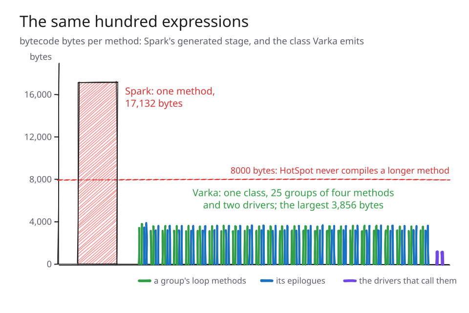
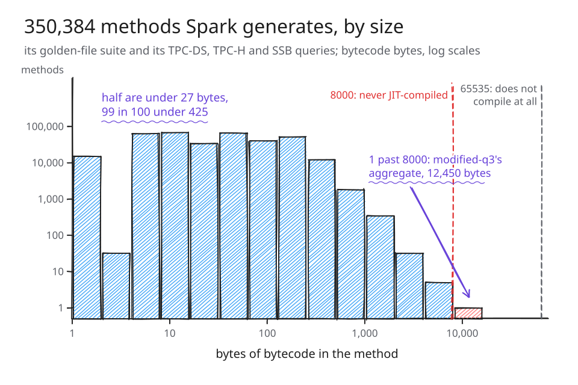
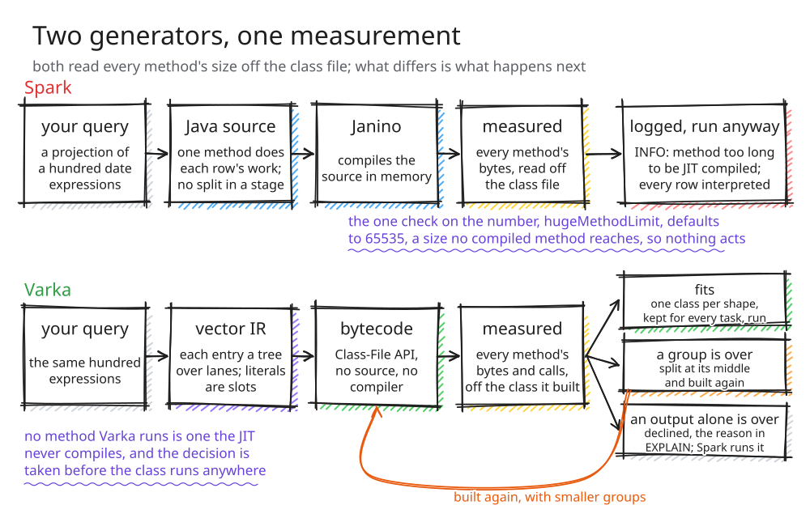
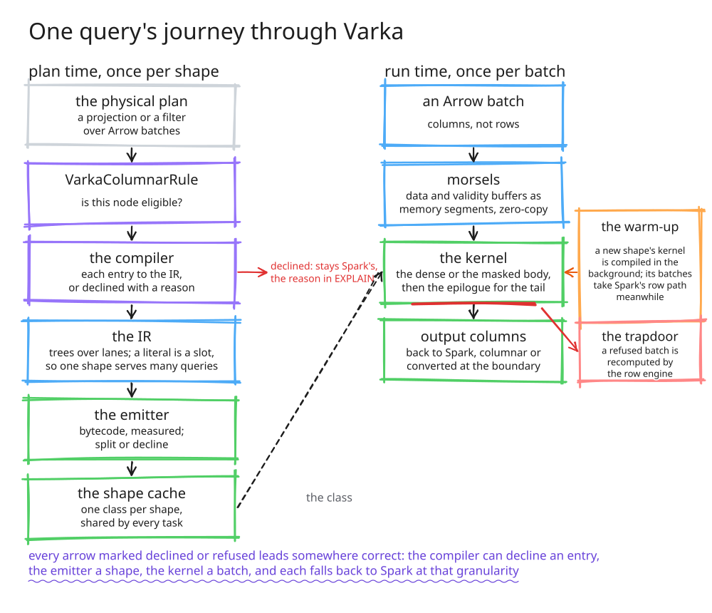
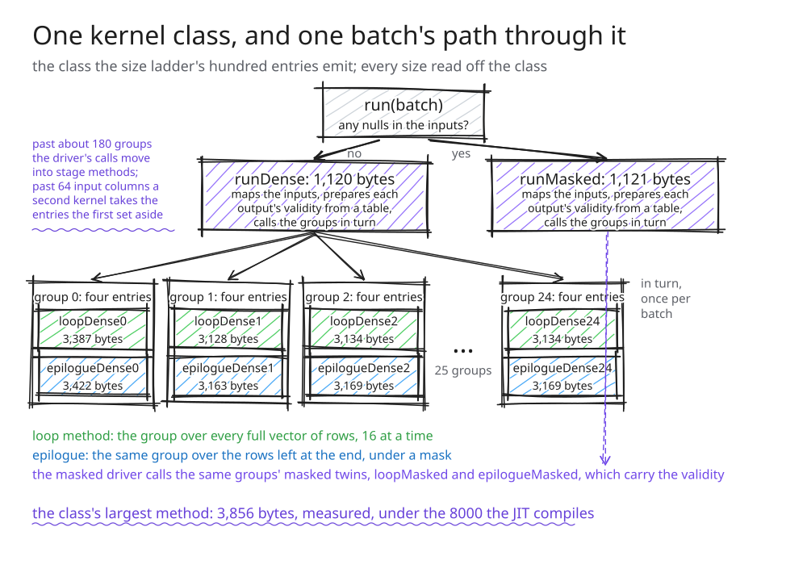
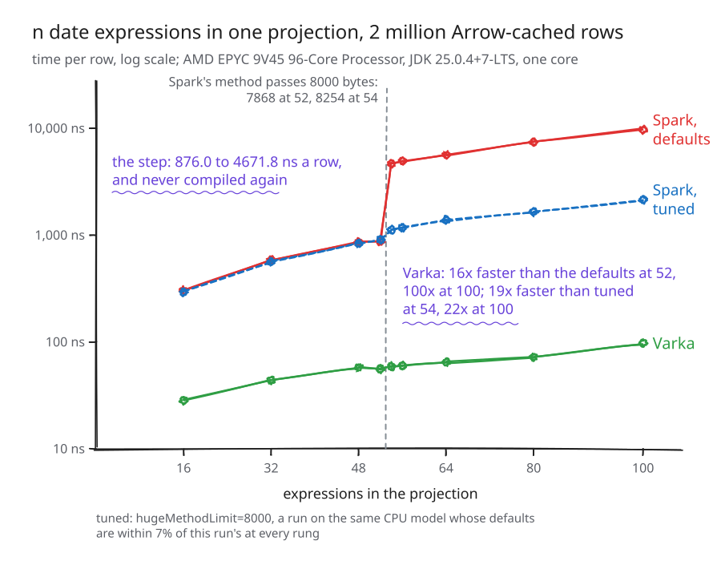
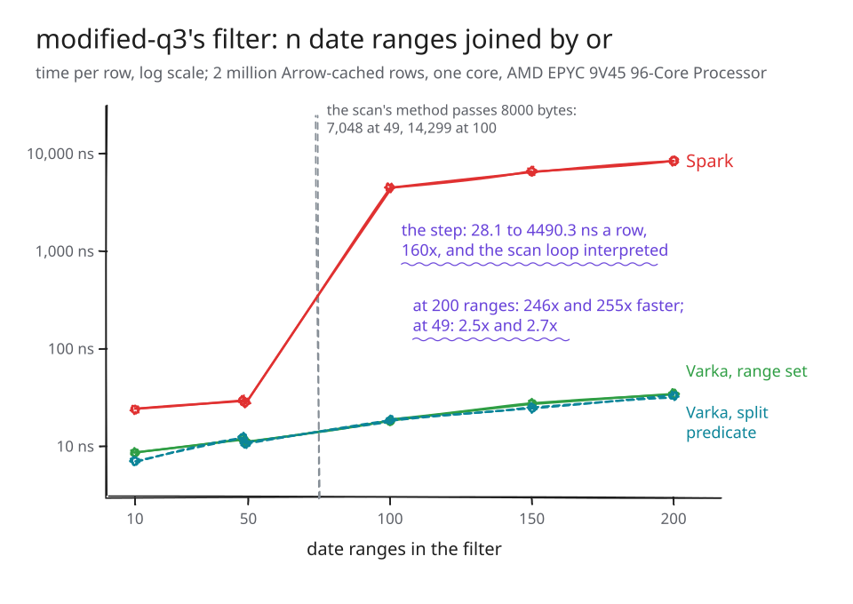
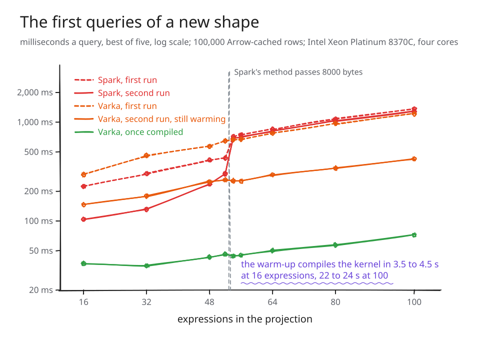

# Under 8000 bytes by construction

---

Here is the same hundred expressions twice.



*Figure 1. A hundred date expressions in one projection. Spark generates one
method of 17,132 bytes that every row runs through; HotSpot never compiles a
method that long. Varka emits one class: a hundred group methods, two drivers
and three small entry points, none over 3,856 bytes, and it reads every one of
those sizes off the class before it runs.*

Spark writes the method on the left and finds out how long it is when the
compiler tells it, by which time the method exists. Varka builds the class on
the right as bytecode, measures each method in the unit HotSpot enforces, and
splits or refuses on the number. That is the whole of this post: not a speed-up,
though there is one, but a property one code generator has and the other
cannot.

The first post in this pair,
[The 8000-byte cliff in Spark SQL](https://vecbricks.github.io/the-8000-byte-cliff/),
was for people who run Spark: where the step is, how to see it on your own
cluster, what to set. This one is for people who read `CodeGenerator.scala`,
and it answers three questions. Why can't Spark just split the method? What
does measuring the class look like, and what did we get wrong doing it? What
does it buy, and what does it cost?

Two facts frame the answers. The cliff is rare in Spark's own queries: of the
350,384 methods Spark generates for its golden-file suite and its TPC-DS, TPC-H
and SSB queries, one is past 8000 bytes, and it belongs to the one TPC-DS query
Spark's suite already exempts from its size check. And it is common in the
shapes people write: a projection of date arithmetic crosses between 52 and 54
entries, a filter of date ranges somewhere between 49 ranges and a hundred.
[Varka](https://github.com/vecbricks/varka) is a research fork of Spark that
compiles a projection or a filter over Arrow batches into one vector loop,
written with the JDK's Vector API and emitted through its Class-File API.
Every number below is from a results file committed beside the post, and the
note at the end says which machine each came from.

## 1. Why can't Spark just split the method?

Because it writes Java, and the JVM counts bytecode.

Spark does split. `spark.sql.codegen.methodSplitThreshold`, 1024 by default,
cuts generated code into methods, and the setting's documentation says what it
counts and why: "We cannot know how many bytecode will be generated, so use the
code length as metric." Measured on a projection of forty `x + k` outside a
stage, the ratio comes to about seven characters of source to a byte: the
default makes methods of 235 bytes, a threshold of 8000 characters makes methods
of 1,435, and the forty unsplit are one method of 3,208. The heuristic keeps
methods far under the 8000 bytes its own comment names. What it never does is
measure the result.

And inside a stage it does not run at all. `splitExpressionsWithCurrentInputs`
concatenates every expression's code into one method whenever
`ctx.currentVars` is set, which is the whole-stage case, at all 26 of its call
sites, and the row writer of a projection stays unsplit there for the same
reason. This is Figure 1's left half, as `EXPLAIN CODEGEN` prints it for the
hundred entries:

```
== Subtree 1 / 1 (maxMethodCodeSize:17132; maxConstantPoolSize:417(0.64% used); numInnerClasses:0) ==
...
/* 125 */   private void project_doConsume_0(InternalRow inputadapter_row_0, int project_expr_0_0, ...
/* 126 */     // common sub-expressions
/* 128 */     boolean project_isNull_0 = project_exprIsNull_0_0;
/* 129 */     int project_value_0 = -1;
/* 131 */     if (!project_exprIsNull_0_0) {
/* 132 */       project_value_0 = ...DateTimeUtils.getLastDayOfMonth(project_expr_0_0);
/* 133 */     }
...
/* 143 */       project_value_3 = ...DateTimeUtils.dateAddMonths(project_expr_0_0, 1);
...
/* 158 */       project_value_6 = project_expr_0_0 + 1;
...
/* 168 */     if (!project_isNull_0 && (project_project_isNull_2_0 ||
/* 169 */         project_value_0 > project_value_2)) {
/* 170 */       project_project_isNull_2_0 = false;
/* 171 */       project_value_2 = project_value_0;
/* 172 */     }
...                 and the same again for the other 99 entries: four thousand lines, one method
/* 4140 */  }
```

Spark knew. In October 2017 SPARK-21871 gave it a limit measured in bytecode,
`spark.sql.codegen.hugeMethodLimit`, default 8000, the right idea in the right
unit: compile the stage, read every method's length from the class file, and
run the stage's operators separately if the largest is over. Four months later,
before 2.3.0 shipped, SPARK-23267 raised the default to 65535, citing
regressions in internal workloads. 65535 is a size no method that compiled can
reach, so since then the check measures every stage and acts on none: it logs
each method past 8000 at INFO, a warning once from 4.4.0, and runs it. The
ladder's stage at 56 entries logs "Found too long generated codes" and falls
back only with the setting put back to 8000.

The test that watched the size went blind in the same way. From 3.0.0 the
TPC-DS, TPC-H and SSB query suites compile every stage and assert that no
method passes 8000 bytes (SPARK-29084), with `modified-q3` exempt pending a fix,
SPARK-29128, that never landed. From 3.2.0 adaptive execution is on by default,
the executed plan is an `AdaptiveSparkPlanExec`, which is a leaf, and the
check's `foreach` walk finds no stage below it. For five years it passed over
nothing. SPARK-59764 runs it with adaptive execution off, in 4.4.0.

The 8000-byte line is one of four limits the JVM puts on a generated class, and
Spark meets each one after the fact. A method of 65535 bytes of code fails to
compile, and the stage runs its operators without whole-stage codegen; at the
thirty or so places that call a generator directly, such as the lazily generated
ordering of a top-k sort, there is no fallback and the query fails. A class of
65535 constant-pool entries fails the same way, and `EXPLAIN CODEGEN` prints the
pool's size without comparing it with anything. A method of 255 parameter slots
is guarded where Spark splits a function out and is an ordinary compile error
elsewhere. We went through `CodeGenerator.scala` and the operators for every
place code generation gives up and found 34, each with Spark's side and Varka's
pinned by a test wherever a query or a hand-built class can reach it; the
[census](https://github.com/vecbricks/varka/blob/master/sql/varka/plans/PLAN_TASK_188.md)
has the table, and `sql/testOnly *VarkaCodegenGiveUpSuite` runs it.

How close does real work come to the line? Spark keeps a histogram of generated
method sizes in `CodegenMetrics`, but it is a decaying sample of about a
thousand values, so we counted instead, with Varka off.



*Figure 2. Every method Spark generates for its golden-file suite and its
TPC-DS, TPC-H and SSB queries, counted by size, against the two limits.*

Half are under 27 bytes and 99 in 100 under 425. Five are between 4000 and
8000, and one is past it: `modified-q3`'s `hashAgg_doAggregateWithKeys_0`, at
12,450. The cliff is not where Spark's test queries go. It is where wide
expressions go, which is why the evidence in section 3 is a ladder of widths
and one realistic filter rather than a sweep of suites.

## 2. Measure the class, then decide



*Figure 3. Both generators read every method's size off the class file. Spark's
one check on the number defaults to a size no compiled method reaches, so the
method is logged and run. Varka splits a group and builds again; a single output
too big for any method is declined with its reason, and Spark computes that one
entry; all of it before the class runs anywhere.*

Varka's emitter never sees Java. It walks an IR of vector operations and writes
bytecode through `java.lang.classfile`, the Class-File API that became final in
JDK 24, so the length of every method's code is a number it reads off the class
it just built. Where that sits in a query's life is the next figure: plan time
decides what Varka runs and builds a class for it, once per shape; run time
executes that class over Arrow batches.



*Figure 4. Plan time, left: the rule that finds an eligible node, the compiler
that translates each entry to the IR or declines it with a reason, the emitter,
and the shape cache every task shares; a literal is a slot in the IR, so one
class serves every query of its shape. Run time, right: Arrow buffers mapped as
memory segments, the kernel, the warm-up thread that compiles a new kernel while
its batches take Spark's row path, and the trapdoor under a batch the kernel
refuses. Every arrow marked declined or refused leads to Spark's own code.*

A kernel is one class, and Figure 5 is the one the hundred entries emit. Its
outputs are partitioned into groups; each group has a loop method, which runs
the group over every full vector of rows, and an epilogue, which runs it over
the rows left at the end under a mask, in a dense twin for batches without
nulls and a masked twin for batches with them. A driver calls the groups in
turn, once per batch.



*Figure 5. The class of Figure 1, method by method: the entry point picks the
dense or the masked driver, the driver prepares every output's validity from a
table and calls the 25 groups in turn, and each group is a loop method and an
epilogue. Every size is read off the class.*

Outputs that share work go in one group, so a prefix such as the civil-from-days
decomposition several date fields need is computed once per vector of rows and
kept in registers. That is also why an output is never split inside: it is
fused so that its intermediates never touch memory.


*Figure 6. From the milestone 5 post: two outputs over the same guarded sum,
and the one loop the emitter writes for them, with one load per input column,
the shared subtree once, and one store per output. The groups of Figure 5 are
this, four entries at a time.*

Here is Figure 5 again as `dev/varka_emit.sh` prints it for the hundred
entries, trimmed to its first columns:

```
method              bytes  IntVector
loopDense0           3387        408
loopDense1           3128        378
...                                     25 loop methods, and 25 more for batches with nulls
epilogueDense0       3422        408
epilogueDense1       3163        378
...                                     25 epilogues, and 25 more for batches with nulls
runDense             1120          0
runMasked            1121          0
class: constant pool 510 of 65535 entries; widest signature runDense at 10 of 255 parameter slots
every method is under HugeMethodLimit (8000)
```

Why so far under the line? Because 8000 is where HotSpot refuses a method,
not where its compiler does well. C2 compiles a Vector API loop by inlining
every vector call into one compilation, and its budgets for that run out long
before 8000 bytes of bytecode; the calls that do not fit stay calls, into boxed
scalar code. Sixty-four cheap outputs in one 3,763-byte method compiled to
72,613 instructions with no vector multiply in them, at 243 to 266 ns a row
against 3.3 for the same outputs in four methods: compiled, under the limit,
and seventy times slower. So the groups are sized in operations, for C2:
sixteen a method, or up to four hundred when the outputs share a prefix that is
cheaper to compute once, a ceiling set by compile time. The ladder's entries all
share one, so its groups fill to that ceiling, four entries each, which for this
family is 3,100 to 3,900 bytes.

The 8000-byte budget is the backstop behind that. After the class is built,
every method is measured against it and the class against the class-file caps. A group
with a method over the budget is split at its middle output and the class built
again, until it fits. An output over the budget on its own is declined, with a
reason that names the method, its bytes and the budget, and is not split inside,
for the reason Figure 6 shows: not yet, that is, since a spill inside the
output, one intermediate written to a scratch column and read back, is the next
milestone's work. The compiler asks the question at plan time, through a shape cache that builds and
measures the class without defining it, so a declined output never reaches an
executor: it stays on Spark's path as a residual entry of the same node, the
rest of the projection fuses, and `EXPLAIN` says why. Here one output is a
balanced `greatest` over thirty-two `add_months`, too heavy for any method, and
the other a `date_add`:

```
Varka [2]: [h: residual (over the emitter's method budget (loopDense0 is 23505
  bytes, over the method budget of 8000 (HugeMethodLimit): HotSpot never compiles
  it): greatest(greatest(greatest(greatest(greatest(add_months(d, 1), add_months(d,
  ...), a: fused]
```

**We had the cliff too.** Until 24 September the epilogue was one method over
every output, a decision from when kernels were narrow. On a projection of
`make_date(year(d), month(d), k)` entries it passed 8000 bytes at 13 outputs and
reached 41,338 at sixty, while the loop methods, one per group, stayed under the
limit. Nothing in our tests noticed, because the answers were right. The JVM's
compile log did: read in a forked JVM under `-XX:+PrintCompilation`, it showed
every loop method reaching C2 and the single epilogue at no tier. A bytecode
emitter is not immune to the limit; it is only able to see it. An epilogue per
group fixed it, and a test reads the same compile log to keep it fixed.

**Then the limit moved to the caller.** The driver used to set up each output's
validity and literals in code repeated per output, and passed 8000 bytes at
about 140 outputs. It now does that work in two calls that read tables baked
into the class, so it grows by 44 bytes a group and holds about 180 groups; past
that, its calls move into stage methods, each calling a run of groups, sized
from the driver's measured bytes. Past 64 input columns, a second kernel takes
the entries the first set aside. Spark met the same displacement outside a
stage: its splitter puts the branches of a wide `CASE WHEN` into small methods,
about three to a method, and the method holding the calls grows with them, 2141
bytes at 300 branches and 8060 at 1000, where it stops being compiled.
SPARK-59783, in 4.4.0, groups those calls into methods of their own, which is
the fix Varka's stages make.

**Compiled is not the same as inlined.** Splitting has a cost no size check
sees. Run a `CASE WHEN` of 300 `WHEN v = k THEN v * k` branches outside a stage
in a forked JVM under `-XX:+PrintInlining`, and C2 says what it did with the
101 split methods when it compiled the method that calls them:

```
@ 4     ...::caseWhen_0_0$ (233 bytes)    inline (hot)
@ 18    ...::caseWhen_0_1$ (237 bytes)    inline (hot)
...
@ 158   ...::caseWhen_0_11$ (240 bytes)   failed to inline: size > DesiredMethodLimit
@ 172   ...::caseWhen_0_12$ (240 bytes)   failed to inline: size > DesiredMethodLimit
...                                       90 of the 101 refused this way
```

C2 inlines at most 8000 bytes of bytecode into one compilation,
`DesiredMethodLimit`, a second budget with the same number, which no product
JDK lets you change. At 16 branches it inlines five of six split methods; at 300,
11 of 101. Each refused method is compiled on its own, so the code is compiled
and still pays a call per method for every row. The same refusals show inside a
stage on apache/spark#59069, SPARK-33301's split of `CASE WHEN` there, still in
review. Varka's calls are per batch, not per row, and the numbers in the next
section include every one of them.

*A second limit sits below 8000 bytes. C1, HotSpot's first compiler, refuses a
method of about a hundred Vector API calls whatever its bytes, and such a method
waits seconds for C2. Varka's emitter keeps wide groups under that count too, at
no cost we can measure, and leaves groups of a few heavy expressions past it,
where splitting would cost more than the wait. The ladder's groups are of that
kind.*

## 3. What it buys, and what it costs



*Figure 7. Time per row against the number of entries, on a log scale: Spark
under its defaults and with `hugeMethodLimit=8000`, and Varka, on an AMD EPYC
9V45, one core.*

The ladder is the first post's shape, `n` entries of
`greatest(add_months(d, k), date_add(d, k), last_day(d))` over two million
cached dates, on the runner pool's full-width 512-bit machine. At 52 entries
Spark's method is 7,868 bytes and the stage is compiled; at 54 it is 8,254 and
never is. The query gets five times slower between those two entries and stays
slow. Varka's line barely moves: it is 16 times faster than Spark at 52 entries,
where both are compiled, 79 times at 54, and a hundred times at a hundred.

Tuned, Spark does much better. With `hugeMethodLimit=8000` a stage past the
limit runs its operators separately, the step becomes a slope, and Varka is
still 19 times faster at 54 entries and 22 times at a hundred. Most of that is
the gap Varka has below the line, where nothing is interpreted: tuning removes
the cliff, and what is left is a vector loop against a row loop. What no setting
does is bound a method in bytes.



*Figure 8. A filter of `n` date ranges joined by `or`, over two million cached
rows on the same machine: Spark and Varka's two designs.*

The one TPC-DS query past the line is `modified-q3`, and its predicate is two
hundred date ranges joined by `or`, the shape a BI tool writes for a set of
reporting periods. On a cached date column that filter steps 160 times between
49 ranges and a hundred, where the ladder steps five, because it is generated
into the scan's `processNext`: when that method is not compiled, the loop over
the rows is interpreted with it. Varka has two designs for a predicate too large
for one method, a range set over a static table of bounds and a predicate split
across several selection outputs that the filter combines, and both are on. At
200 ranges each runs about 250 times faster than Spark, and below the crossing
about two and a half times. The range set stays the design for ranges because
it starts faster: it plans a filter of 200 ranges in half the time, and the JIT
has it compiled in a tenth of a second against three.

**The accelerators.** Gluten, Comet and Photon avoid the method limits by
leaving the JVM: for the operators their native libraries implement there is no
64KB method and no 8000-byte compile refusal. What they pay is a coverage
boundary, past which they fall back to Spark and every limit above returns.
Comet draws that boundary with the contract Varka arrived at on its own: a
support level per expression, the fallback reason in `EXPLAIN`, and no
conversion until every child that produces data is native. An engine that
evaluates one expression node at a time over a whole batch needs neither native
code nor a size limit; Velox works this way in C++, and vecruntime 0.0.3 does it
on the JVM with the Vector API, as a plugin for stock Spark 4.1. On the ladder,
on the same machine, vecruntime has no step, and pays about 58 ns a row for each
entry instead, the price of the four columns each entry writes and reads back.
Below the cliff that makes it three times slower than Spark; at a hundred
entries it is faster than Spark's defaults and still slower than Spark tuned;
and Varka runs the same hundred entries 59 times faster than it. Having no cliff
is all an engine of that kind gets. Fusion is what keeps the intermediate values
out of memory, as whole-stage code does, without its limit.



*Figure 9. A new shape's first query, left, and its second, right, with the
kernel once compiled beside it: Spark against Varka with its warm-up, over a
hundred thousand cached rows on a four-core Intel Xeon Platinum 8370C runner.*

**The first query.** Everything above is steady state, and a new shape pays for
its kernel once: Varka plans it, emits the class, and the JIT has to compile it
before it is fast. By default a background thread warms the kernel while the
shape's batches run on Spark's own projection outside a stage, where the
splitter does work, and the kernel takes over when the JIT has compiled it. Past
the cliff Varka's first query is already a little faster than Spark's, 665 ms
against 713 at 54 entries on a four-core runner, and its second much faster, 255
against 686. Below the cliff the compiled stage wins until the kernel is ready,
294 ms against 224 at 16 entries, and the warm-up takes three and a half to four
and a half seconds there, 22 to 24 at a hundred entries. After it, 16 entries
take 37 ms against Spark's 104, and 54 take 44 against 686. The kernel is keyed
by the expression's tree and not its literals, so a dashboard that reruns one
shape with new values pays once.

---

A generator of source can only guess how large its methods are, and finds out
from the compiler when the method already exists. Varka asks the same question
of the class it built, in the unit the JVM enforces, before the class runs
anywhere. Every limit the first post described is then a number to compare and
a reason to give, and what does not fit is left to Spark, which runs it the way
it always has. The code, the census, the benchmarks and every results file
quoted here are in [vecbricks/varka](https://github.com/vecbricks/varka).

*How this was measured.* Spark, wherever this post times it, is a September
2026 build of Spark master: this fork with Varka off. Every timing is from a
results file committed beside the post, with a provenance file naming the
commit, the run, the runner's CPU, the JDK and the kernel, and a checker reads
every measured number in the project's documents and fails on one that no
committed file contains. The ladder and the filter ran on GitHub-hosted runners
through the fork's benchmark workflow, with the CPU named in the dispatch so
that a run landing on any other machine stops before the build; the AMD EPYC
9V45 is the pool's one full-width 512-bit machine, four of thirty-six dispatches
drew it, and the file quoted is the run nearest the median of the four, whose
Varka rows are within 5 to 21% of each other at each rung. The tuned numbers of
section 3 are another run on the same CPU model, whose defaults read within 7%
of the ladder run's at every rung; `wholeStage=false` reads the same as
`hugeMethodLimit=8000` there. The ladder runs on one core; on a four-vCPU EPYC
7763 with every core busy its ratio past the step is 30 to 34 times against 53
to 59 on one core of that machine, since Spark's interpreter divides its time by
2.9 over four threads and Varka's kernels by 1.7, two threads of a core sharing
one vector unit. The ladder ran two days before the driver from a table landed:
its group methods are Figure 1's, byte for byte, and its drivers were 5,278 and
5,932 bytes where the figure's are 1,120 and 1,121; the table form ran the
hundred entries 3 to 8% faster on the same runner. vecruntime reads Parquet
where Varka reads its Arrow cache, and Spark runs the ladder as fast from one as
from the other; it converts none of the date chains. The method sizes depend on
no machine. The prose rounds; the figures and the [results
files](https://github.com/vecbricks/varka/tree/master/sql/core/benchmarks)
carry the exact values.
