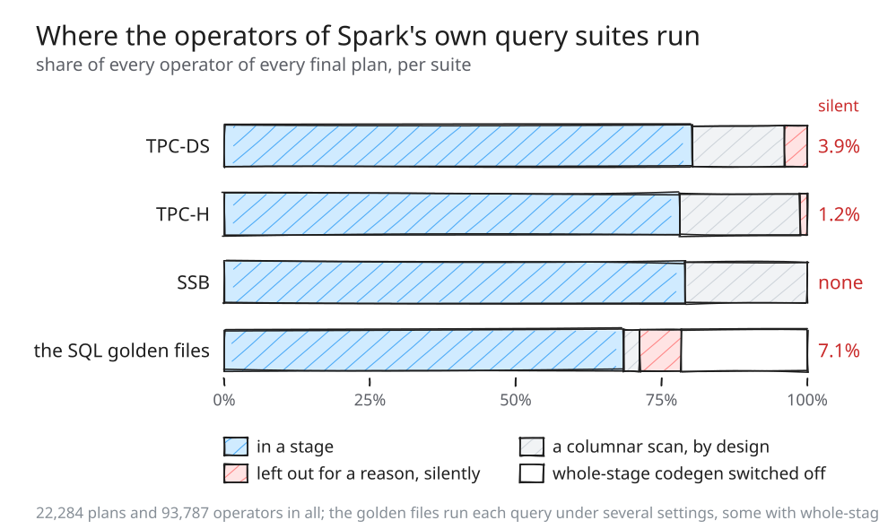
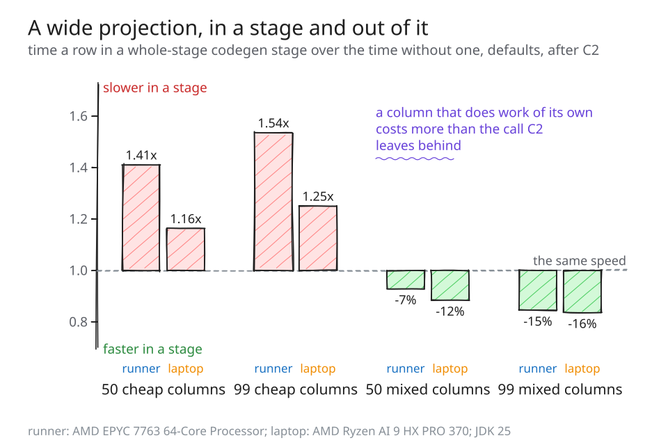
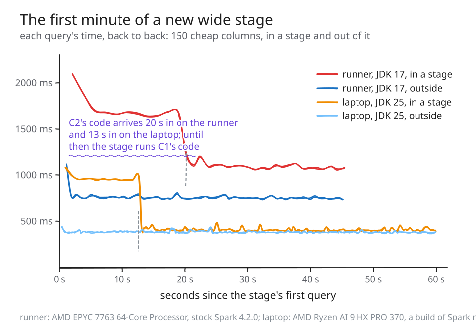

# When Spark stops compiling your query

---

Spark SQL compiles your query into Java. Most of the time it compiles all of it: each stage of
the plan becomes one generated method, and the operators inside it pass values to each other in
local variables instead of rows. Sometimes it compiles less than all of it, and it rarely says
so. An operator drops out of its stage and nothing is logged. A stage stays in and runs slower
than it would outside. A limit is crossed and the only line about it is at a level the shell
hides. A method fails to compile and Spark quietly interprets it instead. And once in a while
the query just fails.

This post is about those cases, in the order you would meet them: what each looks like, what it
costs, how to see it on your own cluster, and what to do. It is written for people who run
Spark, and it follows [The 8000-byte cliff in Spark
SQL](https://vecbricks.github.io/the-8000-byte-cliff/), which covered the best
known of them. Every snippet runs on a stock Spark 4.2.0 distribution.

> **If you have five minutes**
>
> 1. An operator without a `*(n)` in front of it in `EXPLAIN` runs outside whole-stage
>    codegen. That is usually by design and cheap; section 1 says which ones are worth a look.
> 2. A projection of fifty or more cheap columns - arithmetic, copies, casts of numbers - can be
>    slower inside a stage than outside one. Do not raise `spark.sql.codegen.maxFields` to keep
>    a wide projection in its stage; for a query like that, lowering it can help (section 2).
> 3. Two lines of `log4j2.properties` show the give-ups Spark logs at INFO (section 3).
> 4. To find all of this across a whole application's history, run one script over your event
>    logs (the closing section).

How often does it happen? We counted every operator of every final plan in Spark's own query
suites - the SQL golden files, TPC-DS, TPC-H and SSB, 22,284 plans and 93,787 operators. In the
TPC suites almost nothing leaves its stage that is not meant to: 3.9% of TPC-DS's operators,
most of them top-k sorts and windows, and not one operator for a function without generated code
or for a schema that is too wide. In the golden files, which exercise everything Spark can do,
it is 7.1%, and every one of them leaves without a line in the log.



*Figure 1. The share of operators in a whole-stage codegen stage, outside one by design (a
columnar scan, which a stage reads through a conversion), and outside one for a reason, per
suite.*

The benchmarks are not the queries people write, though. The ones that leave a stage in the
golden files are the constructs a real query may well have: an object aggregate such as
`collect_list`, a Python UDF, a window, a JSON function, a higher-order function over maps.

## 1. Silent: the operator that leaves its stage

```
show("a window is not part of any stage", spark.sql(
  "select id, sum(id) over (partition by g order by id) as running from t"))
```

```
+- *(2) Project [id#0L, running#17L]
   +- Window [sum(id#0L) windowspecdefinition(g#1L, id#0L ASC NULLS FIRST, ...
      +- *(1) Sort [g#1L ASC NULLS FIRST, id#0L ASC NULLS FIRST], false, 0
```

The `*(1)` and `*(2)` are stage numbers; `Window` has none. No line is logged, at any level. The
same happens to an `ObjectHashAggregate` (what `collect_list` and friends plan into), a Python
UDF's evaluation, a top-k sort, a projection with more than a hundred output columns (the
`maxFields` limit), and any operator holding a function that has no generated code. Of those
functions, `from_json` is the one you are likeliest to have; `get_json_object`, `json_tuple` and
`to_json` generate code, and so do `transform`, `filter` and `aggregate`. `zip_with`,
`map_filter`, `map_zip_with`, `transform_keys` and `transform_values` do not.

**What it costs.** Less than you might fear. An operator outside a stage still compiles its own
expressions; what it loses is the stage, the passing of values in locals, so it pays to write a
row and read it back at its boundary. We priced that for `from_json` in a projection of 16, 32
and 48 date expressions over a million cached rows: next to the same projection with
`get_json_object` instead, which keeps the stage, it costs at most 135 to 224 nanoseconds a
row, the same at every width - and the JSON function itself costs about a microsecond. The give-up is the
smaller part of the bill.

**What not to do.** The obvious rewrite - compute everything else first, then `from_json` in a
projection of its own - does not survive the optimizer. `CollapseProject` merges the two
projections back into one, and over an aggregate it merges the projection into the aggregate,
which then leaves its stage too:

```
+- HashAggregate(keys=[_groupingexpression#14L], functions=[sum(id#0L)])
   +- *(1) HashAggregate(keys=[_groupingexpression#14L], functions=[partial_sum(id#0L)])
```

**What to do.** Where a function that generates code does the job, use it: with
`get_json_object` in place of `from_json` every operator above stays in its stage. Otherwise,
leave it; a fifth of a microsecond a row is rarely the problem.

**See it yourself:**
[`silent.scala`](https://github.com/vecbricks/varka/blob/master/sql/varka/demo/silent-giveups/silent.scala)
and
[`rewrite.scala`](https://github.com/vecbricks/varka/blob/master/sql/varka/demo/silent-giveups/rewrite.scala).
Run the query before you explain it: with adaptive execution on, the stages exist only once the
query has run.

## 2. In a stage, and slower

This is the one that surprised us. A stage is supposed to be the fast path, and for most
operators it is: an aggregate of 40 or 60 sums runs 1.6 to 2.1 times faster in a stage than
without one. But a wide projection of cheap columns runs slower inside a stage than outside it,
under the default settings, once everything is compiled:

| projection | AMD EPYC 7763 | Intel Xeon 8573C | laptop, Zen 5 |
|:--|--:|--:|--:|
| 50 cheap columns (`id + k`) | 1.41 times slower | 1.28 times slower | 1.16 times slower |
| 99 cheap columns | 1.54 times slower | 1.65 times slower | 1.25 times slower |
| 50 mixed columns | 7% faster | | 12% faster |
| 99 mixed columns | 15% faster | | 16% faster |

*The mixed projection cycles through six kinds of column: an addition, `date_add`, a string
`concat`, a division over a cast, a null test over a nullable column and `substr`.*



*Figure 2. Time per row in a stage and outside one, for cheap and mixed projections of 50 and 99
columns, on three processors.*

On stock Spark 4.2.0 the same 99 cheap columns are 1.30, 1.45 and 1.37 times slower in a stage
with JDK 17, 21 and 25.

**Why.** The JIT compiler that makes Java fast, C2, inlines small methods into the method that
calls them, and it has a budget for how much: about 8000 bytes, counting the caller's own
bytecode. A stage's method writes each output column through a small helper. With 25 columns
the method is under a thousand bytes and C2 inlines every write. With 50 it is 1,861 bytes, and
C2's log says, fifty times, `failed to inline: size > DesiredMethodLimit`: the budget is spent,
and every row pays fifty real calls. Outside a stage, Spark splits the same projection into small
methods, each of which has room to inline its writes. A column that does real work - builds a
string, shifts a date - costs more than the call it leaves behind, which is why the mixed
projection still wins in a stage. How much the calls cost depends on the processor: on the Zen 5
chips we measured the loss is small, on Zen 3 and Zen 4 servers it is half again.

**What to do.** For a query that is a wide projection of cheap columns, lower
`spark.sql.codegen.maxFields` below the projection's width for that query; the projection leaves
its stage and the rest of the plan stays in one. On the runner it took 99 cheap columns from 800
to 521 nanoseconds a row. Do not do it for a projection that computes; there the stage wins.

**And do not raise `maxFields` to keep a wide projection in.** The first post said to raise it
with care and check the method's size. The method's size is not the risk. A 150-column
projection of cheap columns, let into one stage by `maxFields=200`, has a method of 5,747 bytes,
well under any limit - and for its first 12 to 22 seconds it runs two and a half to three and a
half times slower than outside a stage while C2 compiles it, on every JDK, and then stays 1.2 to
1.8 times slower on the runners (1.06 on the laptop). Every executor pays those seconds again for every stage it compiles.



*Figure 3. Each query's time, back to back for a minute, for the 150-column projection in a stage
and outside one.*

**See it yourself:**
[`compile_wait.scala`](https://github.com/vecbricks/varka/blob/master/sql/varka/demo/silent-giveups/compile_wait.scala)
prints every query's time and when it settled.

## 3. Hidden in the log

Some give-ups are logged, at INFO, and `spark-shell` shows WARN and above. The method too long to
be JIT compiled, from the first post. A common subexpression or an aggregate whose split
functions would need more than the JVM's 255 parameter slots, so Spark keeps them in one method:

```
INFO CodegenContext: Failed to split subexpression code into small functions because the
  parameter length of at least one split function went over the JVM limit: 255
```

And the aggregate whose fast hash map Spark did not generate, because a key such as a struct is
one it does not support. To see them, add two loggers to `conf/log4j2.properties`:

```
logger.codegen.name = org.apache.spark.sql.catalyst.expressions.codegen
logger.codegen.level = info
logger.hashagg.name = org.apache.spark.sql.execution.aggregate.HashAggregateExec
logger.hashagg.level = info
```

The shell then shows those lines and no other INFO line of Spark's, apart from one `Code
generated in ... ms` for each class it compiles. From Spark 4.3.0 the method-too-long line comes
from `CodeCompiler` rather than `CodeGenerator`, in the same package, so the setting above covers
both; from 4.4.0 the first such method is a warning that names the remedy.

**See it yourself:**
[`log_level.scala`](https://github.com/vecbricks/varka/blob/master/sql/varka/demo/silent-giveups/log_level.scala)
with [its two
lines](https://github.com/vecbricks/varka/blob/master/sql/varka/demo/silent-giveups/log_level.log4j2.properties).

## 4. Logged, with a fallback

Past 64 KB a method does not compile at all, and Spark has two fallbacks. A stage that fails
logs an ERROR, then

```
WARN WholeStageCodegenExec: Whole-stage codegen disabled for plan (id=1):
```

and runs its operators one by one, each still compiled - what the first post measured as an
eighth to a fifth slower on its shape. A projection outside a stage that fails is evaluated by
the interpreter instead:

```
WARN UnsafeProjection: Expr codegen error and falling back to interpreter mode
```

That costs more: 3.1 to 4.4 times the compiled projection's time on the runner, 3.6 to 4.4 on the
laptop, from 100 to 1000 columns. You are unlikely to hit it with the defaults, since Spark splits
a projection's code into methods well before 64 KB; it takes one enormous expression, or method
splitting turned off.

## 5. Failing the query

About thirty places in Spark call a code generator directly, with no fallback, and there a
compile failure is the query's. `ORDER BY ... LIMIT` is one: the top-k operator generates its
ordering itself. An ordering over a 1,200-branch `CASE WHEN`, with method splitting off, fails:

```
org.codehaus.commons.compiler.InternalCompilerException: ... Code grows beyond 64 KB
```

Again this takes an expression far larger than most queries have. The other case on our list, a
compile on the executor with no fallback, we could not provoke at all; we mention it because it
exists.

## How you'd know, across your own history

A missing `*(n)` is easy to see in one query and impossible to see across thousands. But every
Spark event log (`spark.eventLog.enabled=true`) records each query's final plan, its operators'
names and strings, and the settings the session changed, which is all it takes to classify every
operator the way Spark did, offline. A short script does it:

```
python3 varka_codegen_report.py /path/to/spark-events/
```

It prints, for all the applications in the logs, how many operators ran in a stage and, for the
rest, why, with the operators and functions most often to blame - the table this post's census
is built from. Over the event log of the golden-file suites it matched the census within 2% on
every reason. It is
[`dev/varka_codegen_report.py`](https://github.com/vecbricks/varka/blob/master/dev/varka_codegen_report.py),
plain Python with no dependencies.

---

None of this is a bug in the usual sense: each case is a decision Spark makes on purpose, mostly
the right one. What is missing is the telling. A per-operator mark in the SQL metrics, saying an
operator ran outside whole-stage codegen and why, would turn section 1 into something the UI
shows; a count of the fallbacks beside the existing codegen metrics would do the same for section
4. Neither exists yet.

*How this was measured.* Every number here is from a results file committed beside the post.
The census and the classifier ran on the golden-file, TPC-DS, TPC-H and SSB suites of a build of
Spark master from October 2026. The costs are from four Spark-style benchmarks on the same
build, run on GitHub-hosted runners (an AMD EPYC 7763 and 9V74 and an Intel Xeon 8573C) and on a
laptop with an AMD Ryzen AI 9 HX PRO 370, with JDK 25; the snippets' outputs are from stock
Spark 4.2.0 with JDK 17, 21 and 25, on runners that drew an EPYC 7763, 9V74, 9V45 and a Xeon
8573C. Every comparison is between numbers from the same run. The prose rounds; the [results
files](https://github.com/vecbricks/varka/tree/master/sql/core/benchmarks) and [the snippets'
outputs](https://github.com/vecbricks/varka/tree/master/sql/varka/demo/silent-giveups) carry the
exact values.
