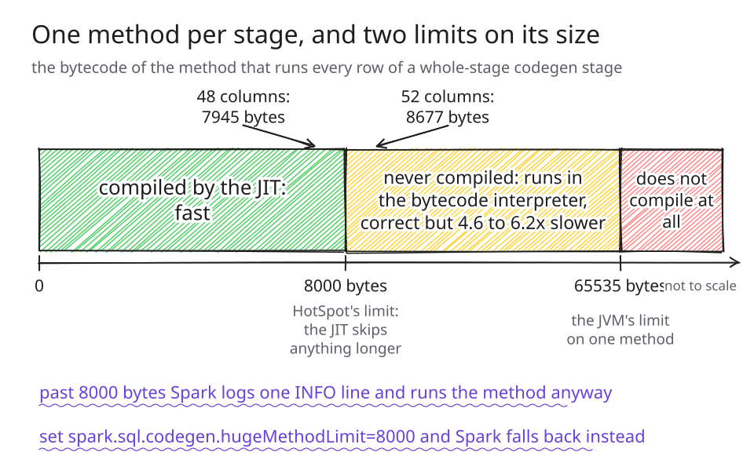
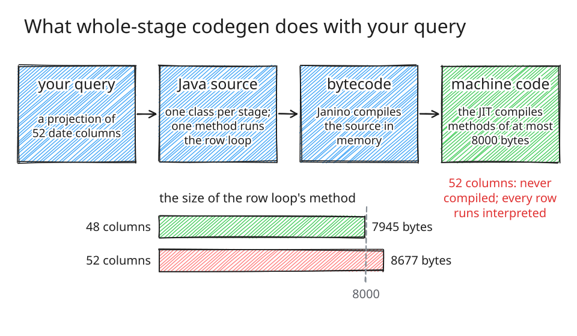
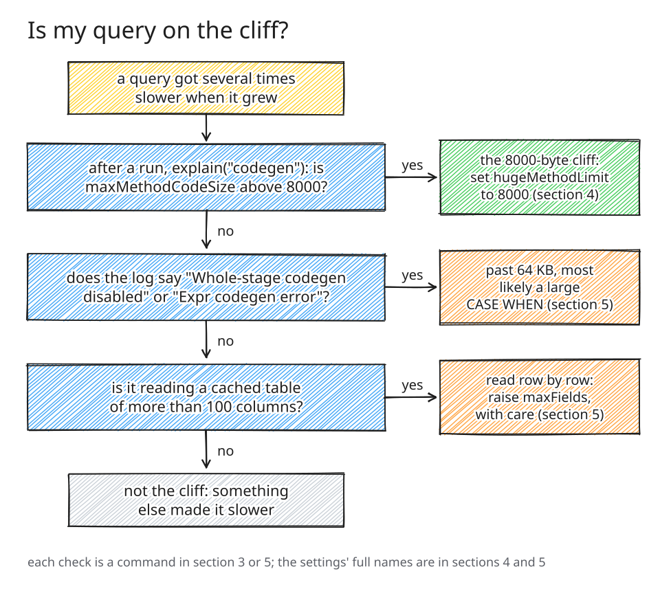
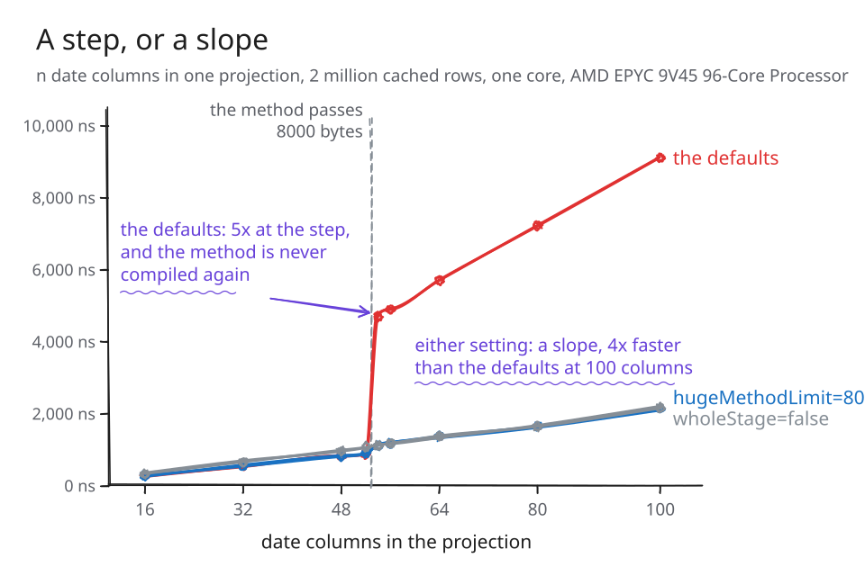
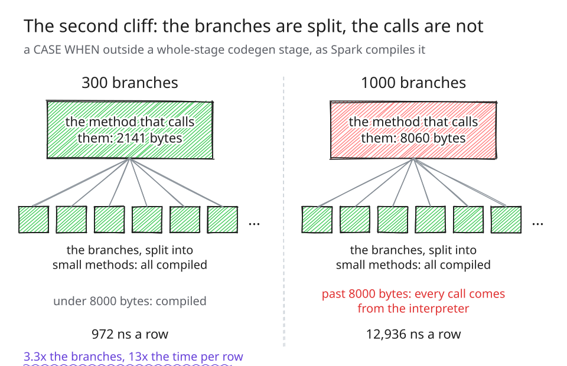

# The 8000-byte cliff in Spark SQL

---

A query gets six times slower and nothing you can see has changed. The plan
is the same, the data is the same, the cluster is the same. Somebody added a
few columns to a projection, a few branches to a `CASE WHEN`, or a few more
date ranges to a filter, and the time per row went up by a factor rather than
a fraction. Spark noticed, and said so in one line of its log, at a level the
shell does not show.

This post is about that step: where it is, how to see it on your own cluster,
what to set, and which Spark release fixes which part. It is written for
people who run Spark. A second post covers the internals.



*Figure 1. Spark runs each stage of a query as one generated Java method.
Below 8000 bytes of bytecode the JIT compiles it; between 8000 and 65535 it
runs in the bytecode interpreter; past 65535 it does not compile at all. The
projection of section 1 crosses the first line between 48 and 52 columns.*

> **If a query got several times slower when it grew**
>
> 1. Run `EXPLAIN CODEGEN` on it. A stage whose header says
>    `maxMethodCodeSize` above 8000 is on the cliff.
> 2. Set `spark.sql.codegen.hugeMethodLimit=8000` for that query or job. The
>    step becomes a gentle slope.
> 3. From Spark 4.4.0 the log warns you the first time, and names that
>    setting.

How often does this happen? Rarely in the standard benchmarks: across all 178
TPC-DS and TPC-H queries, in six configurations, exactly one stage crosses the
line, and it is a query Spark's own test suite already excludes. Often in the
shapes people write: a wide projection of date arithmetic crosses at about
fifty columns, and a filter of date ranges, the kind a BI tool writes for a
set of reporting periods, somewhere between fifty and a hundred. The first
fact is why you may never have met it. The second is why, when you do, it
looks like nothing you have seen before.

## 1. A few more columns, six times slower

Here is the step on stock Spark 4.2.0, measured on GitHub-hosted runners with
three JDKs. The query projects `n` columns of the same everyday shape,
`greatest(add_months(d, k), date_add(d, k), last_day(d))`, over half a million
dates.


*Figure 2. Time per row against the number of columns, one line per JDK, with
the size of the stage's method under each point. The step is where that size
passes 8000 bytes, and it is in the same place on every JDK.*

From 48 to 52 columns the time per row goes from about 1,500 to about 9,200
nanoseconds on JDK 25, 6.2 times. JDK 17 steps 5.5 times and JDK 21 4.6 times,
at the same place, because Spark writes the bytecode, not the JDK. On one
core, a hundred million rows would go from about two and a half minutes to
fifteen.

Filters step the same way. On a September 2026 build of Spark master, a
filter of date ranges joined by `or` over an integer date key runs at about 50
nanoseconds a row with 49 ranges and about 9,000 with a hundred. Same filter,
twice the ranges, nearly 180 times the cost.

**See it yourself.** Figure 2 comes from one script,
[`method_size_cliff.scala`](https://github.com/vecbricks/varka/blob/master/sql/varka/demo/method_size_cliff.scala),
which needs nothing but a stock Spark 4.2.0 distribution and a few minutes. It
prints each size, the method's bytes, and the time per row with and without
the setting of section 4:

```
curl -O https://raw.githubusercontent.com/vecbricks/varka/master/sql/varka/demo/method_size_cliff.scala
bin/spark-shell --master local[1] -i method_size_cliff.scala
```

## 2. What Spark generates, and the two limits

Spark does not interpret your query row by row. For each stage of the plan it
writes Java source, compiles it in memory with Janino, and runs the result,
and the loop over the stage's rows sits in one method. That is whole-stage
code generation, and it is much of why Spark is fast.



*Figure 3. From your query to machine code, and the method that does not make
the last step: at 52 columns the row loop's method is 8677 bytes, and the JIT
never compiles it.*

The step comes from two limits on that method, and both are the JVM's.

**8000 bytes.** HotSpot does not JIT-compile a method longer than 8000 bytes
of bytecode. The limit is fixed in every product build of the JDK, and the
flag behind it, `DontCompileHugeMethods`, is on by default. A method past it
runs in the bytecode interpreter however hot it gets. The answers are right;
every row is just several times slower.

**65535 bytes.** A Java method cannot be longer than 64 KB at all. Past that
the compile fails, Spark logs a warning, and it runs the stage's operators one
by one instead. That is slower than a compiled stage and much faster than an
interpreted one, so the smaller limit is the one to worry about.

**Why Spark cannot stay under 8000.** It writes source, and the JVM counts
bytecode. The setting that splits generated code into smaller methods counts
characters, and its own documentation says why: "We cannot know how many
bytecode will be generated, so use the code length as metric." The setting
that does measure bytecode, `spark.sql.codegen.hugeMethodLimit`, defaults to
65535, a size no compiled method can exceed, so by default it never acts. The
[history of these limits](https://github.com/vecbricks/varka/blob/master/sql/varka/plans/PLAN_TASK_205.md)
and a [census of all 34 places](https://github.com/vecbricks/varka/blob/master/sql/varka/plans/PLAN_TASK_188.md)
where Spark's code generation gives up are written up separately.

The larger limit used to be the famous one. Spark's tracker holds 44 tickets
that quote the compiler's "grows beyond 64 KB", 28 of them from 2016 and 2017,
before the fixes that shipped in Spark 2.3.0. The 8000-byte step left no such
trail. It does not fail; it answers, slowly.


*Figure 4. The tracker's tickets carrying the compiler's 64 KB message, by
year filed.*

**Check the JVM's side.** The limit is the JVM's own, and it will say so:

```
java -XX:+PrintFlagsFinal -version | grep DontCompileHugeMethods
     bool DontCompileHugeMethods      = true      {product} {default}
```

## 3. Is your query on the cliff?



*Figure 5. From the symptom to the three checks below, and what each answer
means.*

**The method's size, from the plan.** `EXPLAIN CODEGEN` prints the generated
code of every stage, and the header above each carries the number that
matters. This one is the demo at 52 columns:

```
== Subtree 1 / 1 (maxMethodCodeSize:8677; maxConstantPoolSize:387(0.59% used); numInnerClasses:0) ==
```

`maxMethodCodeSize` above 8000 is the cliff. It needs no log level and no
restart.

**The log.** When Spark compiles a stage it measures every method, and for one
past the limit it writes:

```
INFO CodeGenerator: Generated method too long to be JIT compiled:
  ...GeneratedIteratorForCodegenStage1.project_doConsume_0$ is 8677 bytes
```

`spark-submit` prints it, because the default logging level is INFO.
`spark-shell` does not: the shell sets its level to WARN on startup, in the
line everyone scrolls past. From Spark 4.4.0 the first such method is a
warning that names the remedy:

```
WARN CodeCompiler: Generated method too long to be JIT compiled: ... is 8677 bytes,
  so it runs interpreted on every row. Setting spark.sql.codegen.hugeMethodLimit
  to 8000 runs such stages without whole-stage codegen instead.
```

The larger limit logs `WARN WholeStageCodegenExec: Whole-stage codegen
disabled for plan`, or, outside a stage, `WARN UnsafeProjection: Expr codegen
error and falling back to interpreter mode`. Both are warnings, so the shell
shows them; section 5 has their likely cause.

**The JVM's own word.** Start the driver with `-XX:+PrintCompilation`. The
compile log names each generated method the JIT compiles, with its size, and
the ones past 8000 bytes never appear:

```
bin/spark-shell --master local[1] --driver-java-options "-XX:+PrintCompilation" \
  -i method_size_cliff.scala 2>&1 | grep project_doConsume
```

## 4. What the settings do



*Figure 6. The projection of section 1 on a build of Spark master, under the
defaults and under the two settings that work. The defaults step and stay up;
either setting turns the step into a slope.*

| setting | the step | the price | use it? |
|--|--|--|--|
| `spark.sql.codegen.hugeMethodLimit=8000` | becomes a slope | about a quarter more per column past the limit, nothing below it | yes, for the query or job |
| `spark.sql.codegen.wholeStage=false` | becomes a slope | slower even below the limit: a sixth to a fifth on this query | only for the query that needs it |
| `spark.sql.codegen.factoryMode=NO_CODEGEN` | much worse | forty times slower on a thousand-branch `CASE WHEN` | no |
| `-XX:-DontCompileHugeMethods` | moves further out | the JIT gives up on a bigger method instead | no |

**`hugeMethodLimit=8000` is the one to use.** With the limit at the size
HotSpot enforces, Spark measures the compiled stage, finds the long method,
and runs the stage's operators one by one, each with small methods of its own.
On the runner of Figure 6 the defaults go from about 900 to 4,700 nanoseconds
a row between 52 and 54 columns; with the setting, from 900 to 1,100. At a
hundred columns the setting is four times faster than the defaults, and below
the limit it changes nothing. The setting is marked internal, but its own
documentation suggests exactly this value for HotSpot. On stock 4.2.0 the step
of section 1 shrinks to between 1.1 and 1.3 times.

**`factoryMode=NO_CODEGEN` looks tempting and is not.** It turns code
generation off for projections and filters, and Spark's interpreter is
compiled Scala, so it sounds like a way around an uncompiled method. But the
interpreter of a `CASE WHEN` looks up its branches by position in a linked
list, walking from the head each time, so one row costs time that grows faster
than the square of the branch count. On a thousand branches it is forty times
slower than the uncompiled generated code it would replace, and going from 300
branches to 1000 multiplies its cost by twenty. The documentation says the
setting is "NOT supposed to be set by end users", and it means it.

**`-XX:-DontCompileHugeMethods` moves the cliff.** It is the first flag anyone
who knows the JIT reaches for, and at the crossing it does what it says: no
step between 52 and 54 columns. At a hundred columns, a 17 KB method, the JIT
runs out of its own budget, logs `COMPILE SKIPPED: out of nodes during split`
if you ask it to, and the defaults are five and a half times slower than
`hugeMethodLimit=8000` in the same run. The size where that happens depends
on what the code does, on every executor. Leave the flag on.

Before 4.4.0 nothing in the default configuration tells you, and nothing keeps
the stage compiled past the limit. The choice is between a step and a slope,
and the slope is the better deal. Try it on the demo:

```
bin/spark-shell --master local[1] --conf spark.sql.codegen.hugeMethodLimit=8000 -i method_size_cliff.scala
```

## 5. Two traps

Two shapes where the cause hides behind something else.

**A large `CASE WHEN` is slow in every configuration.** Inside a stage its
branches are not split into methods at all: the stage's one method is 2853
bytes at 30 branches, 9433 at 100, 32605 at 300, and at 1000 it does not
compile. Without whole-stage codegen, the branches are split into small
methods, and those compile. But the calls to them stay in one method, and that
method has a cliff of its own.



*Figure 7. Outside a stage, the branches are split and compiled, but the
method holding the calls grows with them: 2141 bytes at 300 branches, 8060 at
1000, where it stops being compiled.*


*Figure 8. The same `CASE WHEN` inside a stage, outside one, and interpreted,
on log axes.*

Read Figure 8 from left to right. At 30 and 60 branches everything is
compiled, and the stage is as fast as no stage or faster. At 100 the stage's
method is past 8000 bytes and the stage is six times slower than the same
query without it. At 1000 the stage fails to compile and falls back to the
split code, and it pays for the failed compile again on every run, about half
a second. And between 300 and 1000 branches the split code itself costs
thirteen times more per row for three and a third times the branches, because
the method holding the calls crossed 8000 bytes on the way. Two upstream
changes address the two halves; section 6 says where they are. The second is
in 4.4.0: with it the same 1000 branches outside a stage cost 2309.9 ns a
row instead of 12935.8, and the stage that fails to compile, which falls back
to that code, 4680.4 instead of 15409.3.

**A wide cached table is read row by row, even for one column.** Spark reads
a cached table in batches when three things hold: the vectorized cache reader
is on, which is the default; every column is a number or a boolean; and the
table's schema is within `spark.sql.codegen.maxFields`, a hundred fields by
default. A table with one string, date or decimal column is read row by row
at any width, and this trap does not apply to it. For an all-numeric table
the width decides, and the count is of the whole cached table, not of what
the query reads. The same data in a Parquet file is read in batches, because a
file scan counts only the columns it reads.


*Figure 9. One column summed and every column read, over a cached table of
100 and of 101 int columns, and of 101 with the limit raised.*

For a one-column sum it costs nothing: both paths decode only the column the
query reads, and in two runs on two machines the 101-column table was a little
faster, not slower. For a read of every column, the shape a `df.cache()` is
usually made for, it costs five times on the runner of Figure 9 and two and a
half times on a Xeon, and raising the limit to 101 gives it all back. Raise it
with care: `maxFields` is also the width past which Spark keeps an operator out
of whole-stage codegen, so a projection of 150 columns that ran as separate
operators will run as one method with the limit at 200, and that method may be
past 8000 bytes. Check `maxMethodCodeSize` after.

**See which one you have.** For the cache, `EXPLAIN FORMATTED` shows a
`ColumnarToRow` above an `InMemoryTableScan` that produces batches, and none
above one that does not. For the `CASE WHEN`, `EXPLAIN CODEGEN` and its
header, as in section 3.

## 6. Which release fixes what

Read from the tracker on 26 September 2026.

| ticket | what changes for you | state |
|--|--|--|
| SPARK-59774 | the 8000-byte line becomes a warning, once, naming the remedy | fixed in 4.4.0 |
| SPARK-59764, SPARK-59765 | Spark's own size check over the TPC-DS queries runs again | fixed in 4.4.0 |
| SPARK-59783 | a wide `CASE WHEN`, `COALESCE` or `IN` outside a stage stays compiled | fixed in 4.4.0 |
| SPARK-33301 | a large `CASE WHEN` inside a stage is split into methods | in review, [apache/spark#59069](https://github.com/apache/spark/pull/59069) |
| SPARK-56908 | generated code shrinks across operators | umbrella, 57 of 58 sub-tasks done |

The umbrella has made the largest method of any unmodified TPC-DS query about
a quarter smaller since Spark 4.2, which widens the margin for the queries
that were already under the line. It does not bound the method: a projection
of 54 date columns still crosses, because nothing in the pipeline counts bytes
before the compile.

---

The limits are the JVM's, and the guessing is the generator's. A system that
writes source cannot know how many bytes a method will be until the compiler
tells it, and by then the method exists. An engine that emits bytecode
directly can measure the method in the unit the JVM enforces before anything
runs, and split or refuse on the number rather than on a guess. The second
post in this pair is about one that does: `[[link to the second post]]`.

*How this was measured.* Every number here is from a results file committed
beside the post: the demo's outputs on stock Spark 4.2.0 with JDK 17, 21 and
25, and four Spark-style benchmarks on a September 2026 build of Spark master
with JDK 25. All ran on GitHub-hosted runners, which are not one machine: the
files name an AMD EPYC 9V45, 9V74 and 7763 and an Intel Xeon Platinum 8370C,
and every comparison in the text is between numbers from the same run. The
prose rounds; the figures and the
[results files](https://github.com/vecbricks/varka/tree/master/sql/core/benchmarks)
carry the exact values.
