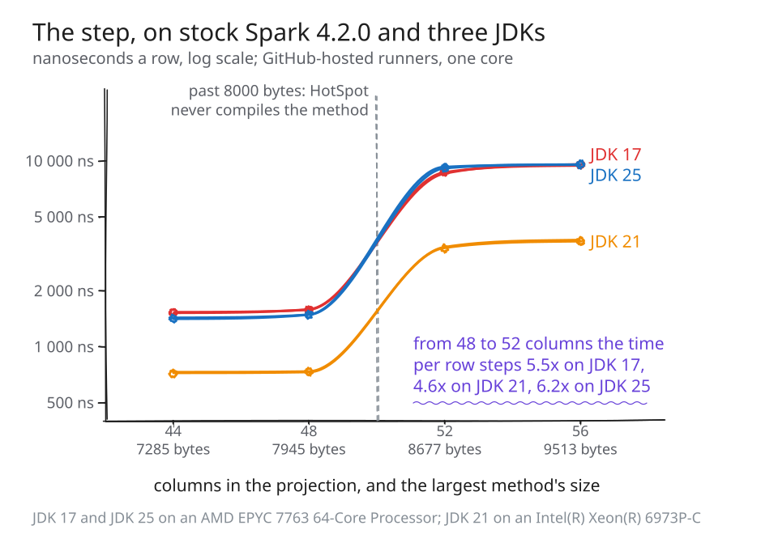
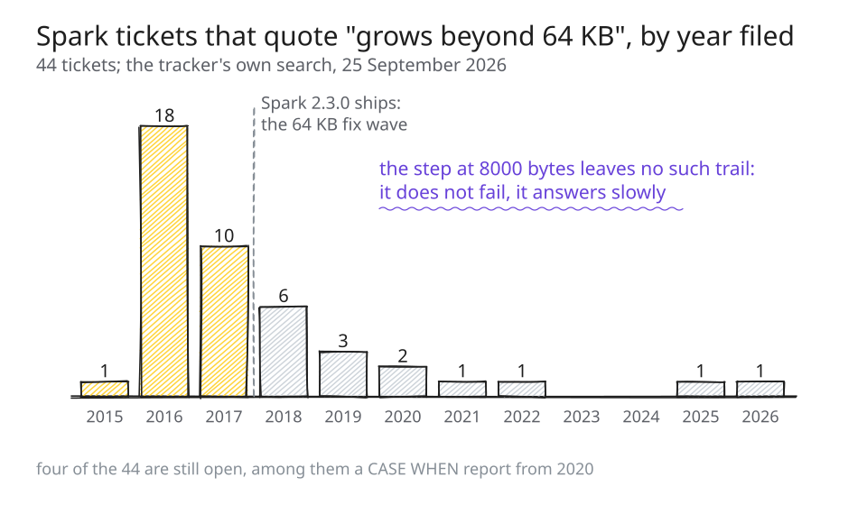
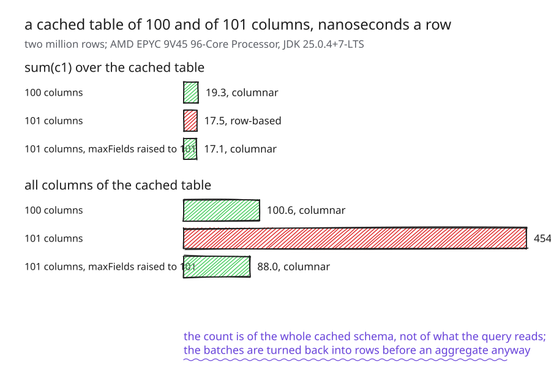
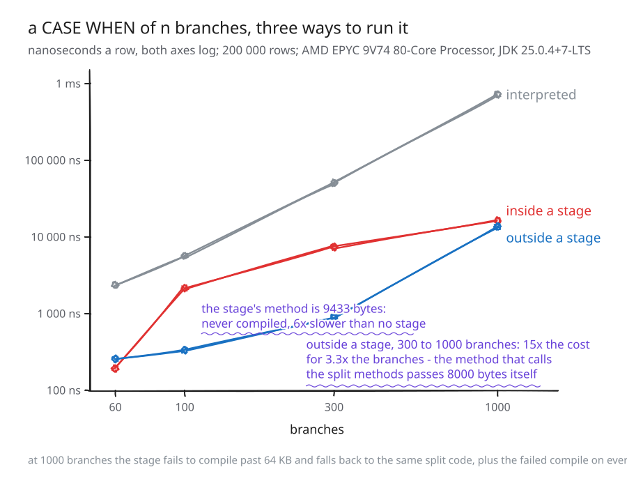

# Where Spark's code generation gives up

*The first of the two posts that close milestone 6, drafted 25 September 2026
from `PLAN_TASK_210.md`. This is the first version: every number in it is from
a committed results file. The items still owed are marked `[[...]]` and listed
in the plan's section 9.*

---

A query gets slower by five times and nothing you can see has changed. The plan
is the same, the data is the same, the cluster is the same. Somebody added a
few columns to a projection, or a few branches to a `CASE WHEN`, or a few more
date ranges to a filter, and the time per row went up by a factor rather than
a fraction. If you look for it, Spark says one line about it, at a level the
shell does not show. This post is about that step: where it is, why Spark
cannot avoid it, how to see it on your own cluster, what the settings do and
do not do about it, and which release fixes which part.

Two things first, so the rest is in proportion. It is rare in the standard
benchmark suites: across all 178 TPC-DS and TPC-H queries under six
configurations, exactly one stage crosses the limit, and it is the one query
Spark's own test suite already excludes. And it is not rare in the shapes
people write: a wide projection of date arithmetic crosses at about fifty
entries, and a filter of date ranges, the shape a BI tool writes for a set of
reporting periods, crosses somewhere between fifty and a hundred ranges. The
first fact is why you may never have met it. The second is why, when you do,
it looks like nothing you have seen before.

## 1. A query that got five times slower when it grew

Here is the step, on stock Spark 4.2.0, on GitHub-hosted runners, on three
JDKs. The query projects `n` columns of date arithmetic, each one
`greatest(add_months(d, k), date_add(d, k), last_day(d))`, over half a million
generated dates. Nothing about it is exotic.

| entries | largest generated method | ns per row, JDK 17 | JDK 21 | JDK 25 |
|--:|--:|--:|--:|--:|
| 44 | 7285 bytes | 1537.2 | 717.2 | 1414.7 |
| 48 | 7945 bytes | 1574.5 | 734.7 | 1483.9 |
| 52 | 8677 bytes | 8712.7 | 3375.4 | 9194.0 |
| 56 | 9513 bytes | 9534.4 | 3691.0 | 9582.2 |

Between 48 and 52 entries the time per row goes up by 5.5 times on JDK 17,
4.6 on JDK 21 and 6.2 on JDK 25. The step is at the same place on all three,
because the generated bytes are the same on all three: Spark writes them, not
the JDK.



*Figure 1. The demo's projection on stock Spark 4.2.0: nanoseconds a row
against the number of expressions, one line per JDK, with the size of the
largest generated method under each rung. The step is where that size passes
8000 bytes, and it is in the same place on every JDK.*

The same shape on a different machine and a newer Spark, for the reader who
wants a second witness. A September 2026 build of Spark's master branch, an
AMD EPYC 9V45, the same projection over two million cached rows: 892.8 ns a row at 52
entries, where the largest generated method is 7868 bytes, and 4766.3 at 54,
where it is 8254 bytes. Master crosses two entries later than 4.2.0, because
its generated code is slightly smaller, and the step is the same size.

Filters have the same step. Take a filter of `n` date ranges joined by `or`
over an integer date key, which is what a reporting tool writes for a set of
periods, and what one TPC-DS query does with about fifty of them. On the same
master and an AMD EPYC 9V74: 51.4 ns a row at 49 ranges, where the method is
7048 bytes, and 9121.0 at a hundred, where it is 14299 bytes. At 200 ranges it
is 17520.9 ns a row, for a filter.

You are not the first to hit it. The Spark tracker holds 44 tickets whose text
carries the compiler's message from the older limit, "grows beyond 64 KB":

| year | 2015 | 2016 | 2017 | 2018 | 2019 | 2020 | 2021 | 2022 | 2025 | 2026 |
|--|--:|--:|--:|--:|--:|--:|--:|--:|--:|--:|
| tickets | 1 | 18 | 10 | 6 | 3 | 2 | 1 | 1 | 1 | 1 |

They peak in 2016 and 2017, when Spark still failed loudly at that limit, and
fall away after the fix wave that shipped in 2.3.0. Four are still open, among
them a `CASE WHEN` report from 2020. The step this post is about, at 8000
bytes, has no such trail. It does not fail. It answers, slowly, and says so
once at INFO.



*Figure 2. The tracker's tickets carrying the compiler's 64 KB message, by
year filed. The peak is the failure that used to be loud; the 8000-byte step
does not fail, so it has no such trail.*

**See it yourself.** The script that produced the first table is in the
repository, runs against a stock distribution, and takes a few minutes:

```
bin/spark-shell --master local[1] -i method_size_cliff.scala
```

It prints one line per size, the largest method in bytes, the time per row
under the defaults, and the time per row under the one setting that avoids
the step (section 4), and marks the sizes past 8000 with an asterisk.

## 2. Two numbers: 8000 and 65535

Spark does not interpret your expressions row by row. It writes Java source
for them, compiles it in memory with Janino, and runs the result, and for a
pipeline of operators it writes one class whose one method does the work of
the whole stage. That is whole-stage code generation, and it is why Spark is
as fast as it is. The step comes from two limits on that method, and both are
the JVM's, not Spark's.

**8000 bytes.** HotSpot does not JIT-compile a method whose bytecode is longer
than 8000 bytes. The flag is `DontCompileHugeMethods`, it is on by default,
and the limit behind it, `HugeMethodLimit`, is fixed at 8000 in every product
build of the JDK. A method past it runs in the bytecode interpreter, forever,
however hot it gets. The query is correct. It is just several times slower per
row, and the whole row loop of the stage is inside that method.

**65535 bytes.** A Java method cannot be longer than 64 KB at all. Past that
the compile fails, Spark catches the failure, logs a warning, and runs the
stage with its operators one by one instead of as one method. That path is
slower than a compiled stage and much faster than an uncompiled one, which is
why, of the two limits, the one you should worry about is the smaller.

Why can Spark not stay under 8000? Because it writes source and the JVM
measures bytecode, and the two are not the same unit. The setting that splits
generated code into smaller methods counts characters of source, and its
documentation says so plainly: "We cannot know how many bytecode will be
generated, so use the code length as metric." The setting that could act on
the real size, `spark.sql.codegen.hugeMethodLimit`, measures bytecode after
the compile, but its default is 65535, a size no compiled method can exceed,
so at the default it never fires. Spark set it to 8000 when it added the
setting in 2017 and raised it to 65535 before 2.3.0 shipped; the documentation
still says 8000 "may be preferable" on HotSpot. That history, the 2015 split machinery, the
2017 fix wave, the source-length threshold of 3.0, and a test in Spark's own
suite that checked every TPC-DS stage against 8000 bytes and stopped seeing
any stage when adaptive execution became the default in 3.2, is
[written up separately](https://github.com/vecbricks/varka/blob/master/sql/varka/plans/PLAN_TASK_205.md),
as is a
[census of every place](https://github.com/vecbricks/varka/blob/master/sql/varka/plans/PLAN_TASK_188.md)
Spark's code generation gives up, 34 of them. The second post in this pair is
about the mechanism. This one stays with what you can see and do.

**Check the JVM's side.** The limit is the JVM's own, and it will tell you so:

```
java -XX:+PrintFlagsFinal -version | grep DontCompileHugeMethods
     bool DontCompileHugeMethods                   = true                                      {product} {default}
```

## 3. How to see it on your cluster

Four places, from the cheapest to the most conclusive.

**The size of the method, from the plan.** `EXPLAIN CODEGEN` prints the
generated code of every stage, and the header line above each one carries the
number that matters:

```
== Subtree 1 / 1 (maxMethodCodeSize:8677; maxConstantPoolSize:387(0.59% used); numInnerClasses:0) ==
```

`maxMethodCodeSize` is the largest method of that stage in bytes, measured
after the compile. Past 8000 it will not be JIT-compiled. It needs no log
level, and it is the line above from stock 4.2.0 at 52 entries.

**The one line in the log.** When Spark compiles a stage it measures every
method, and for one past the limit it writes:

```
INFO CodeGenerator: Generated method too long to be JIT compiled:
  org.apache.spark.sql.catalyst.expressions.GeneratedClass$GeneratedIteratorForCodegenStage1.project_doConsume_0$ is 8677 bytes
```

Whether you see it depends on how you run Spark. `spark-submit` prints it,
because the default logging configuration's root level is INFO.
`spark-shell` does not: the shell sets its level to WARN on startup, the
line under "Setting default log level to WARN" that everyone has scrolled
past. From Spark 4.4.0 the first such method is a warning, once, and it names
the remedy:

```
WARN CodeCompiler: Generated method too long to be JIT compiled: ... is 8677 bytes, so it runs
  interpreted on every row. Setting spark.sql.codegen.hugeMethodLimit to 8000 runs such stages
  without whole-stage codegen instead. Further methods over the limit are logged at INFO.
```

**The JVM's own word.** Start the driver with `-XX:+PrintCompilation` and
filter for the stage's method. The compile log names each version of the
method it compiles, with its size in bytes, and the ones past 8000 never
appear at all:

```
bin/spark-shell --master local[1] --driver-java-options "-XX:+PrintCompilation" \
  -i method_size_cliff.scala 2>&1 | grep project_doConsume
   ...  org.apache.spark.sql.catalyst.expressions.GeneratedClass$GeneratedIteratorForCodegenStage1::project_doConsume_0$ (7945 bytes)
```

**The two other messages, for the larger limit.** A stage past 64 KB logs
`WARN WholeStageCodegenExec: Whole-stage codegen disabled for plan (id=1)`
followed by the plan, and runs its operators one by one. A projection outside
a stage that fails to compile logs `WARN UnsafeProjection: Expr codegen error
and falling back to interpreter mode` and runs interpreted. Both are warnings,
so the shell shows them. If you see either, the query has already lost more
than the 8000-byte step costs, and section 5 has the likely reason.

## 4. The settings, and what each one does

There are four things people try. Two work, with a price, one does not, and
one makes it worse. Every number here is from the projection of section 1 on
Spark master, two million cached rows, on GitHub runners; each file is read
against its own baseline, since the runners are not one machine.

**`spark.sql.codegen.hugeMethodLimit=8000` works.** With the limit set to the
size HotSpot enforces, Spark measures the compiled stage, finds a method past
it, logs `Found too long generated codes and JIT optimization might not work`,
and runs the stage's operators one by one, each with its own smaller methods.
On an EPYC 9V45 the defaults go from 892.1 ns a row at 52 entries to 4708.9
at 54; with the limit at 8000 the same rows go from 902.7 to 1122.7. On stock
4.2.0 across the three JDKs of section 1 the step becomes 1.22, 1.29 and 1.12
times instead of 5.5, 4.6 and 6.2. The price is a slope where there was a
flat: past the limit each extra entry costs a little more than it did below,
about a third more per entry on this shape, and at a hundred entries the tuned
run is 2155.6 ns a row against 9113.0 for the defaults. The setting is marked
internal, its documentation suggests exactly this value, and it has no other
effect below the limit: 293.1 against 300.3 at 16 entries.

**`spark.sql.codegen.wholeStage=false` works the same way, everywhere.** With
whole-stage codegen off, every operator has its own methods from the start,
so the step is gone: 1122.9 ns a row at 54 entries, the same as the tuned
line. The price is paid on every query, not only the wide ones: about a fifth
below the limit, 1089.7 against 892.1 at 52 entries. Set it per query, not per
cluster.

**`spark.sql.codegen.factoryMode=NO_CODEGEN` makes it much worse.** It is the
setting that turns code generation off altogether for projections and
filters, and it is tempting because the uncompiled generated method is, after
all, being interpreted, so why not use Spark's own interpreter, which is
compiled Scala? Because Spark's interpreter of a `CASE WHEN` indexes its
branches by position in a list, and a list is walked from the head on every
lookup, so one row costs time that grows with the square of the branch count.
On a thousand-branch `CASE WHEN` it is fifty times slower than the uncompiled
method it was meant to replace, 717953.5 ns a row against 13655.9 on an EPYC
9V74, and from 300 branches to 1000, three and a third times the branches, the
cost per row grows fourteenfold, from 50734.4. The configuration's
documentation says it is "NOT supposed to be set by end users", and it means
it.

**`-XX:-DontCompileHugeMethods` moves the step, it does not remove it.** The
JVM flag that turns off the 8000-byte refusal is the first thing anyone who
knows the JIT reaches for. On an EPYC 7763 it does what it says at the
crossing: 1747.3 ns a row at 52 entries and 1811.6 at 54, no step. Then at a
hundred entries, where the method is 17132 bytes, the defaults read 17522.9 ns
a row against 3194.6 for `hugeMethodLimit=8000` in the same run. The JIT's
first compiler gives up on the big method at every size past 8000 and hands
it to the second, and at some size that depends on what the code does, the
second one runs out of its own budget too, and the log says so in its own
words: `COMPILE SKIPPED: out of nodes during split`. So the flag trades a
cliff you can see for one you cannot, at a size you cannot predict, on every
executor. Leave it on.

What none of them does is make the default configuration say anything at a
level a shell shows, or keep the stage compiled once it is past the limit.
Below 4.4.0 the choice is between a step and a slope, and the slope is the
better deal.

**Try the setting that works.** On the query of section 1:

```
bin/spark-shell --master local[1] --conf spark.sql.codegen.hugeMethodLimit=8000 -i method_size_cliff.scala
```

The last column of its table is this setting; the two should agree.

## 5. Two traps

Two shapes where the step hides behind something else, and a plan will not
show you why.

**A wide cached table is read row by row, even for one column.** Spark reads
a cached table in batches, in columnar form, when the table's schema is
within `spark.sql.codegen.maxFields`, which is a hundred fields by default.
The count is of the whole cached schema, not of what the query reads. So a
table of 101 columns is read row by row by a query that touches one of them,
while the same query over the same data in a Parquet file is read in batches,
because the file scan counts only the columns it reads. For a one-column
aggregate this costs nothing you can measure: on an EPYC 9V45, two million
rows, `sum(c1)` is 19.3 ns a row over a hundred-column table and 17.5 over a
101-column one, because Spark turns the batches back into rows before the
aggregate anyway. For a read of every column it costs four and a half times: 100.6 ns a
row for the hundred columns, 454.9 for the 101, and 88.0 for the 101 with the
limit raised to 101. `df.cache()` followed by a read of the whole thing is the
shape a cached table is usually made for.



*Figure 3. One column summed and every column read over a cached table of 100
and of 101 int columns. The 101-column table is read row by row whatever the
query touches; it costs nothing on the sum and four and a half times on the
whole-table read, and raising the limit restores the batches.*

The remedy is the same setting, raised just past the table's width. Raise it
with care: it is also the width past which Spark keeps an operator out of
whole-stage codegen, so a projection of 150 columns that was running as
separate operators will run as one method with it raised to 200, and that
method may be the one past 8000 bytes. Check `maxMethodCodeSize` after.

**A large `CASE WHEN` is slow in every configuration.** Inside a stage, the
branches of a `CASE WHEN` are not split into methods at all; they are inlined
into the stage's one method, which on Spark master is 2853 bytes at 30
branches, 5673 at 60, 9433 at 100, 32605 at 300, and past 64 KB at 1000. So at
a hundred branches the stage runs interpreted, and at a thousand it fails to
compile, falls back to its operators, and the failed compile is not
remembered: the next run of the query attempts it again. Outside a stage,
which is where the fallback lands, the branches are split into methods, but
the calls to those methods are left in one method, and at a thousand branches
that one is 8060 bytes and interpreted. What that costs per row, on an EPYC
9V74 over 200,000 rows:

| branches | inside a stage | outside a stage | interpreted |
|--:|--:|--:|--:|
| 60 | 193.2 ns | 257.3 ns | 2350.6 ns |
| 100 | 2154.7 ns | 334.3 ns | 5678.6 ns |
| 300 | 7439.8 ns | 893.7 ns | 50734.4 ns |
| 1000 | 16439.8 ns | 13655.9 ns | 717953.5 ns |



*Figure 4. The same `CASE WHEN` inside a stage, outside one, and interpreted,
on log axes. The stage steps where its method passes 8000 bytes; the
outside-a-stage path steps between 300 and 1000 branches, where the method
holding the calls passes it too; the interpreted path grows with the square.*

At sixty branches everything is compiled and the stage is the fastest way to
run the query, as it should be. At a hundred the stage is six times slower
than no stage at all, because its one method is past 8000 bytes and never
compiled while the split methods outside a stage are. At a thousand the two
paths are the same code, since the stage has fallen back to it, and the stage
still costs more because the failed compile of a 23000-line class is paid on
every run: about half a second, a sixth of the time at this row count. And
look at the outside-a-stage column between 300 and 1000: fifteen times the
cost for three and a third times the branches. That is the second cliff. The
branches are split into compiled methods, but the method that calls them
crossed 8000 bytes on the way, and every call now comes from the interpreter.
Two upstream changes address the two halves, and section 6 says where they
are.

**See which one you have.** For the cache, `EXPLAIN FORMATTED` shows a
`ColumnarToRow` above an `InMemoryTableScan` that produces batches, and none
above one that does not. For the `CASE WHEN`, `EXPLAIN CODEGEN` and its
`maxMethodCodeSize` header, as in section 3:

```
spark.sql("EXPLAIN CODEGEN SELECT CASE WHEN v = 1 THEN 1 ... END FROM t").show(false)
```

## 6. Which release fixes what

Read from the tracker on 25 September 2026. The post names the release a fix
ships in and calls nothing merged that is not.

| ticket | what changes for you | state |
|--|--|--|
| SPARK-59774 | the 8000-byte line becomes a warning, once, naming the remedy | fixed, 4.4.0 |
| SPARK-59764, SPARK-59765 | Spark's own size check over the TPC-DS queries runs again | fixed, 4.4.0 |
| SPARK-59783 | a wide `CASE WHEN`, `COALESCE` or `IN` outside a stage stays JIT-compiled | open, [apache/spark#59042](https://github.com/apache/spark/pull/59042) |
| SPARK-33301 | a large `CASE WHEN` inside a stage is split into methods | open since October 2020 |
| SPARK-56908 | generated code shrinks across operators; the largest TPC-DS method is 4962 bytes on master | umbrella, 57 of 58 sub-tasks done |

The umbrella is worth a word. Since May 2026 upstream has been trimming the
generated code operator by operator, and the largest method any unmodified
TPC-DS query generates is now 4962 bytes, a quarter smaller than in 4.2.
That widens the margin under 8000 for the queries that were already under it.
It does not bound the method: a projection of 54 date expressions still
crosses, and will, because nothing in the pipeline counts bytes before the
compile.

---

The limits are the JVM's, and the guessing is the generator's. A system that
writes source cannot know how many bytes a method will be until the compiler
tells it, and by then the method exists. An engine that emits bytecode
directly can measure the method in the unit the JVM enforces, before anything
runs, and split or refuse on the number rather than on a guess. The second
post in this pair is about one that does: `[[link to the second post]]`.
